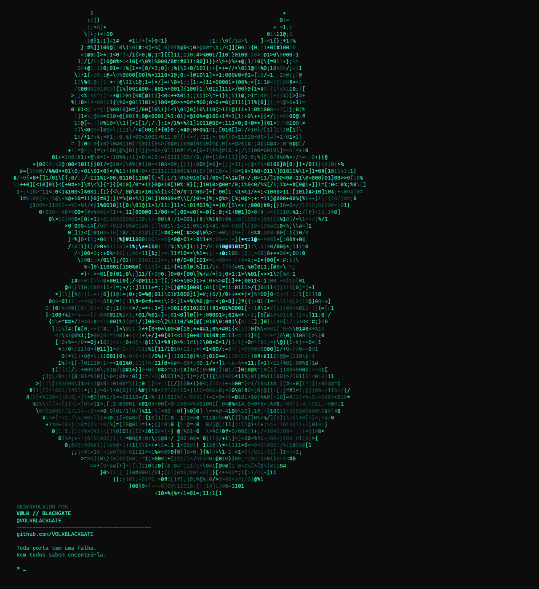
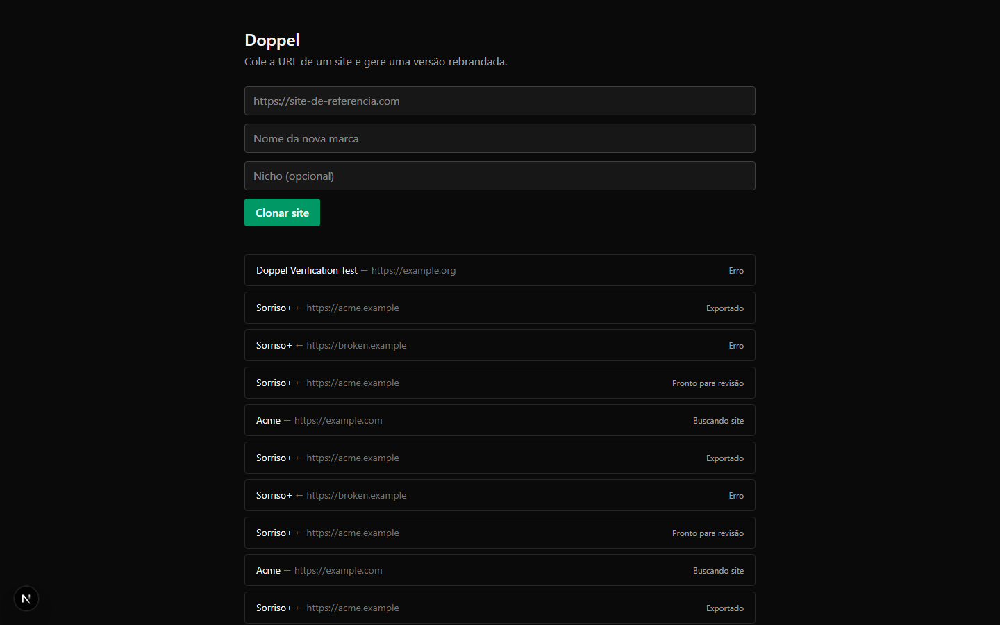
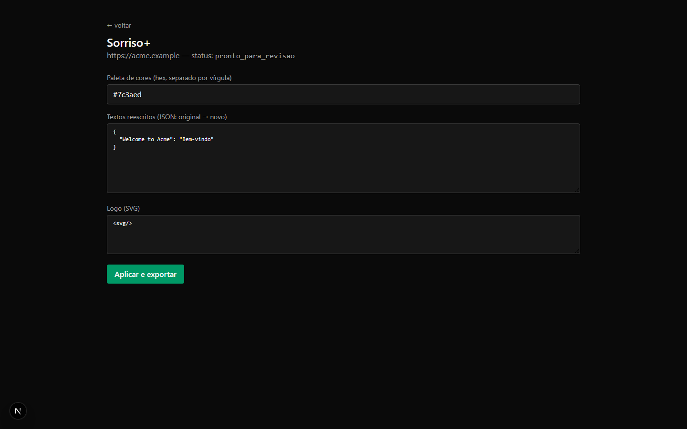
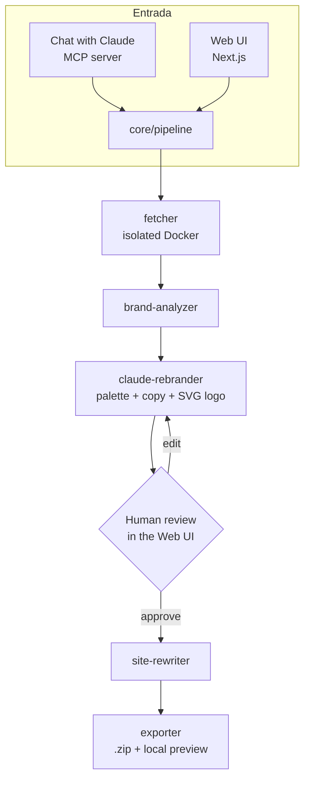

# Doppel

**Clone any site. Rebrand it with AI. Review it side by side. Export a real, working package — all running on your own machine.**

[](https://claude.com)
[](https://nextjs.org)
[](https://www.typescriptlang.org)
[](https://www.prisma.io)
[](https://www.docker.com)
[](LICENSE)

Developed by **VØLK // BLACKGATE** — [@VOLKBLACKGATE](https://github.com/VOLKBLACKGATE)

---

## What it does

Paste a URL. Doppel crawls the site (falling back to a real headless browser for JS-heavy pages), figures out its logo/colors/name, and asks Claude to design a full rebrand — new palette, rewritten copy, a new SVG logo — for whatever brand/niche you tell it. You review the suggestions side by side with the original, tweak anything you don't like, then export a real, downloadable, navigable clone.

Two ways to drive it:
- **From a chat with Claude** (Claude Code or Claude Desktop) via the bundled MCP server — say "clone this site as Brand X" and it runs end to end.
- **From the local web UI**, where the actual visual review happens.

Everything runs on `localhost`. There is no hosted backend — you use your own Claude API usage, at your own cost.

## Why this exists

Built as a demonstration of using Claude as the *decision engine* of a product, not a bolt-on feature: Claude looks at real scraped brand data and makes actual design calls (palette, copy, logo), reviewed and refined by a human before anything ships.

## Screenshots

MCP server startup — the VØLK // BLACKGATE signature, printed before anything else runs:



Dashboard — job history and the new-clone form:



Job review — Claude's rebrand suggestions, editable before you apply them:



## Architecture



Full diagram source: [docs/architecture-diagram.md](docs/architecture-diagram.md)

## Responsible use

Doppel intentionally has **no usage gate** — no confirmation dialog, no license check. It's meant for **study and prototyping**: agency/freelance proposals ("here's how your site could look"), and as a technical showcase. It is not meant to republish a clone of someone else's site as a finished product. Please don't do that.

Doppel also doesn't (and can't) clone backend-dependent behavior: forms, logins, and CMS-driven content stay on the original site's server and won't work in the clone.

## Getting started

**Via Claude (MCP):**
```bash
claude mcp add doppel -- npx doppel-mcp
```
Then, in a chat: *"Clone https://example.com as a brand called Sorriso+, a dental clinic."* Claude prints the banner, bootstraps Docker/Playwright/the local DB on first run, and hands you a `localhost` link to review.

**Via the web app directly:**
```bash
npm install
docker build -f renderer/Dockerfile -t doppel-renderer .
npx prisma migrate deploy --schema prisma/schema.prisma
npm run build
ANTHROPIC_API_KEY=sk-... npm run dev -w web
```
Make sure `ANTHROPIC_API_KEY` is set in your environment before starting — the Claude rebrand step needs it to function.

## Stack

Next.js 15 · TypeScript (strict) · Prisma + SQLite · Playwright · Docker · `@modelcontextprotocol/sdk` · `@anthropic-ai/sdk`

## License

MIT — see [LICENSE](LICENSE).
