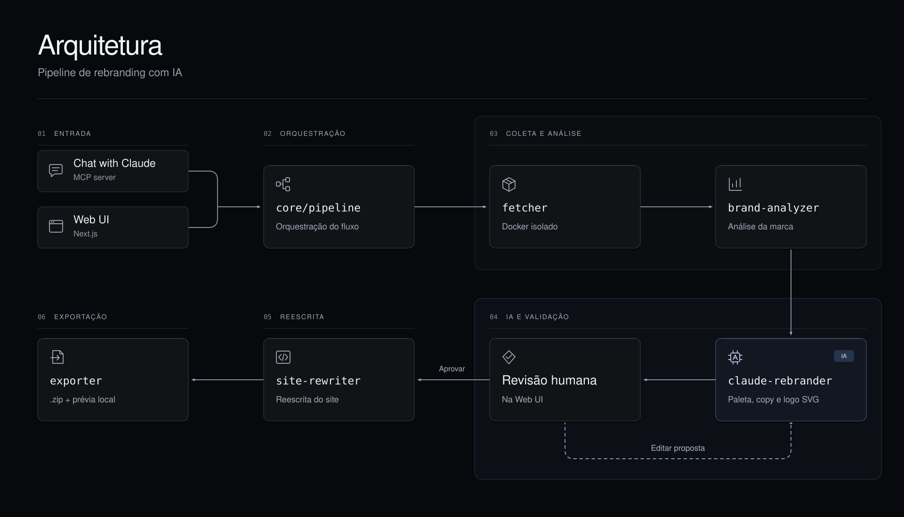

# Doppel

**Clone qualquer site. Rebrande com IA. Revise e edite cada sugestão. Exporte um pacote real e funcional — tudo rodando na sua própria máquina.**

[](https://claude.com)
[](https://nextjs.org)
[](https://www.typescriptlang.org)
[](https://www.prisma.io)
[](https://www.docker.com)
[](LICENSE)

Desenvolvido por **VØLK // BLACKGATE** — [@V0LKBLACKGATE](https://github.com/V0LKBLACKGATE)

---

## O que faz

Cole uma URL. O Doppel rastreia o site (com fallback para browser headless de verdade em páginas com JS pesado), identifica logo/cores/nome, e pede pro Claude desenhar um rebrand completo — paleta nova, textos reescritos, logo novo em SVG — para a marca/nicho que você informar. O site clonado já aparece num preview navegável assim que termina de rastrear, pra você confirmar que a clonagem funcionou antes de decidir qualquer coisa sobre o rebrand.

Aí você revisa a proposta do Claude na UI web local: a paleta (lista de hex), as trocas de texto (frase antiga → frase nova) e o SVG do logo voltam como **campos de texto editáveis**, então dá pra ajustar o que quiser antes de aplicar. Ao exportar, o Doppel reescreve o site e mostra lado a lado com o original — dois previews navegáveis de forma independente — além de um `.zip` do clone rebrandado pra baixar.

O Doppel é instalado e conduzido inteiramente **de uma conversa com o Claude** (Claude Code ou Claude Desktop), via o servidor MCP incluído — peça "clona esse site como a Marca X" e o Claude faz o bootstrap de Docker/banco local/UI web no primeiro uso, e te devolve um link `localhost` pra revisar e editar o rebrand lado a lado com o original.

Tudo roda em `localhost`, na sua própria máquina. Não existe backend hospedado. Definir `ANTHROPIC_API_KEY` é opcional — ela só é usada pra proposta automática de paleta/copy/logo, com seu próprio uso de API e custo; sem ela, dá pra preencher esses campos você mesmo.

## Por que existe

Construído como demonstração de usar o Claude como *motor de decisão* de um produto, não um recurso colado por fora: o Claude olha dados reais de marca extraídos do site e toma decisões de design de verdade (paleta, copy, logo), revisadas e ajustadas por um humano antes de qualquer coisa ser exportada.

## Prints

Inicialização do servidor MCP — a assinatura VØLK // BLACKGATE, impressa antes de qualquer outra coisa rodar:


Dashboard — histórico de jobs e o formulário de novo clone:


Revisão do job — sugestões de rebrand do Claude, editáveis antes de aplicar:


## Arquitetura



Código completo do diagrama: [docs/architecture.svg](docs/architecture.svg)

## Uso responsável

O Doppel propositalmente **não tem nenhuma trava de uso** — sem confirmação, sem checagem de licença. É feito pra **estudo e prototipagem**: propostas de agência/freelancer ("olha como seu site ficaria"), e como vitrine técnica. Não é feito pra republicar o clone de um site de terceiro como produto final. Por favor não faça isso.

O Doppel também não clona (e não tem como clonar) comportamento que depende de backend: formulários, login e conteúdo vindo de CMS continuam no servidor do site original e não funcionam no clone.

## Como usar

**Via Claude (MCP):**
```bash
git clone https://github.com/V0LKBLACKGATE/doppel.git
cd doppel
npm install
npm run build
claude mcp add doppel -- node /caminho/absoluto/para/doppel/mcp-server/dist/index.js
```
> O Doppel ainda não está publicado no npm, então `npx doppel-mcp` não funciona — aponte o comando MCP para o seu build local. Publicar no npm está no plano, mas ainda não foi feito.

Depois, numa conversa: *"Clona https://exemplo.com como uma marca chamada Sorriso+, uma clínica odontológica."* O Claude imprime o banner, faz o bootstrap de Docker/Playwright/banco local e do app web no primeiro uso, e te devolve um link `localhost` pra revisar — sem precisar rodar nenhum comando separado no terminal.

## Desenvolvimento local

Vai mexer no código do próprio Doppel (não só usá-lo)? Rode a UI web e o servidor de preview isolado direto, sem passar pelo Claude/MCP:
```bash
npm install
docker build -f renderer/Dockerfile -t doppel-renderer .
npx prisma migrate deploy --schema prisma/schema.prisma
npm run build
npm run dev -w web
```
`ANTHROPIC_API_KEY` é **opcional**: defina (`ANTHROPIC_API_KEY=sk-... npm run dev -w web`) se quiser que o Claude proponha a paleta/copy/logo automaticamente. Sem ela, esse passo falha mas a clonagem termina do mesmo jeito — a tela de revisão deixa você preencher a paleta, os textos e o logo você mesmo e exportar, sem usar API nenhuma. `npm run dev -w web` sobe o app Next.js e o `preview-server.mjs` juntos (a origem isolada onde os sites clonados de fato renderizam — veja esse arquivo pra entender o porquê).

## Stack

Next.js 15 · TypeScript (strict) · Prisma + SQLite · Playwright · Docker · `@modelcontextprotocol/sdk` · `@anthropic-ai/sdk`

## Licença

MIT — veja [LICENSE](LICENSE).
