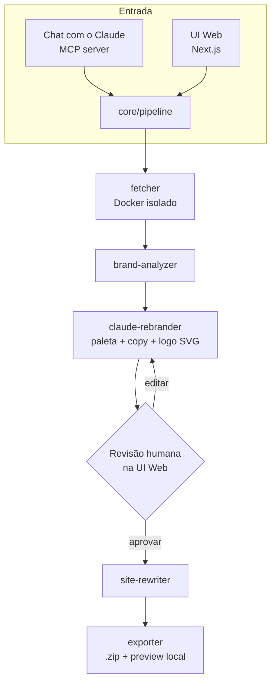

# Doppel

**Clone qualquer site. Rebrande com IA. Revise lado a lado. Exporte um pacote real e funcional — tudo rodando na sua própria máquina.**

[](https://claude.com)
[](https://nextjs.org)
[](https://www.typescriptlang.org)
[](https://www.prisma.io)
[](https://www.docker.com)
[](LICENSE)

Desenvolvido por **VØLK // BLACKGATE** — [@VOLKBLACKGATE](https://github.com/VOLKBLACKGATE)

---

## O que faz

Cole uma URL. O Doppel rastreia o site (com fallback para browser headless de verdade em páginas com JS pesado), identifica logo/cores/nome, e pede pro Claude desenhar um rebrand completo — paleta nova, textos reescritos, logo novo em SVG — para a marca/nicho que você informar. Você revisa as sugestões lado a lado com o original, ajusta o que quiser, e exporta um clone real, navegável e para download.

Duas formas de usar:
- **Direto de uma conversa com o Claude** (Claude Code ou Claude Desktop), via o servidor MCP incluído — peça "clona esse site como a Marca X" e ele roda o fluxo inteiro.
- **Pela UI web local**, onde a revisão visual de fato acontece.

Tudo roda em `localhost`. Não existe backend hospedado — o uso da API do Claude é seu, com seu próprio custo.

## Por que existe

Construído como demonstração de usar o Claude como *motor de decisão* de um produto, não um recurso colado por fora: o Claude olha dados reais de marca extraídos do site e toma decisões de design de verdade (paleta, copy, logo), revisadas e ajustadas por um humano antes de qualquer coisa ser exportada.

## Arquitetura



## Uso responsável

O Doppel propositalmente **não tem nenhuma trava de uso** — sem confirmação, sem checagem de licença. É feito pra **estudo e prototipagem**: propostas de agência/freelancer ("olha como seu site ficaria"), e como vitrine técnica. Não é feito pra republicar o clone de um site de terceiro como produto final. Por favor não faça isso.

O Doppel também não clona (e não tem como clonar) comportamento que depende de backend: formulários, login e conteúdo vindo de CMS continuam no servidor do site original e não funcionam no clone.

## Como usar

**Via Claude (MCP):**
```bash
claude mcp add doppel -- npx doppel-mcp
```
Depois, numa conversa: *"Clona https://exemplo.com como uma marca chamada Sorriso+, uma clínica odontológica."* O Claude imprime o banner, faz o bootstrap de Docker/Playwright/banco local no primeiro uso, e te devolve um link `localhost` pra revisar.

**Direto pela UI web:**
```bash
npm install
npm run build
npm run dev -w web
```

## Stack

Next.js 15 · TypeScript (strict) · Prisma + SQLite · Playwright · Docker · `@modelcontextprotocol/sdk` · `@anthropic-ai/sdk`

## Licença

MIT — veja [LICENSE](LICENSE).
