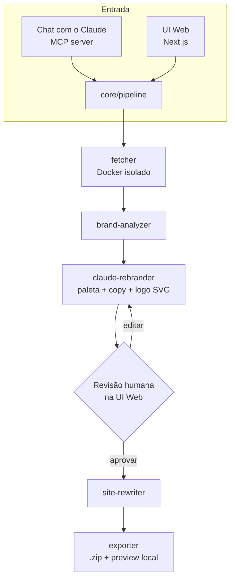

```mermaid
flowchart TB
    subgraph Entrada
        A[Chat com o Claude<br/>MCP server] --> C
        B[UI Web<br/>Next.js] --> C
    end
    C[core/pipeline] --> D[fetcher<br/>Docker isolado]
    D --> E[brand-analyzer]
    E --> F[claude-rebrander<br/>paleta + copy + logo SVG]
    F --> G{Revisão humana<br/>na UI Web}
    G -->|editar| F
    G -->|aprovar| H[site-rewriter]
    H --> I[exporter<br/>.zip + preview local]
```
