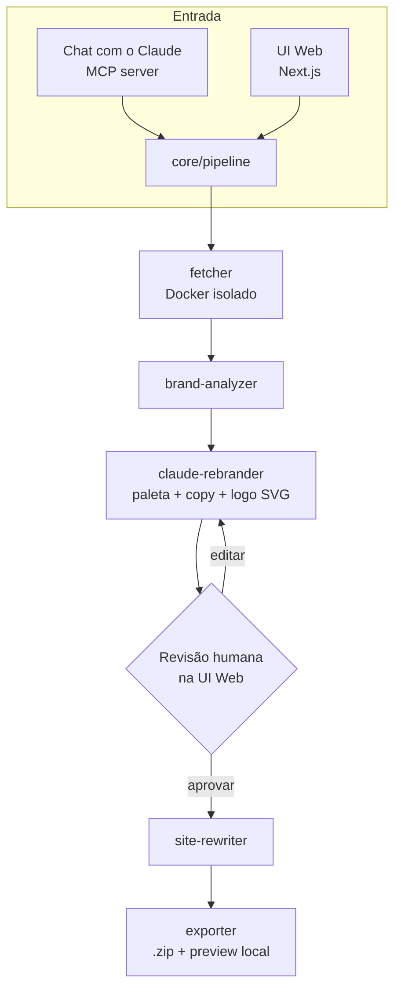
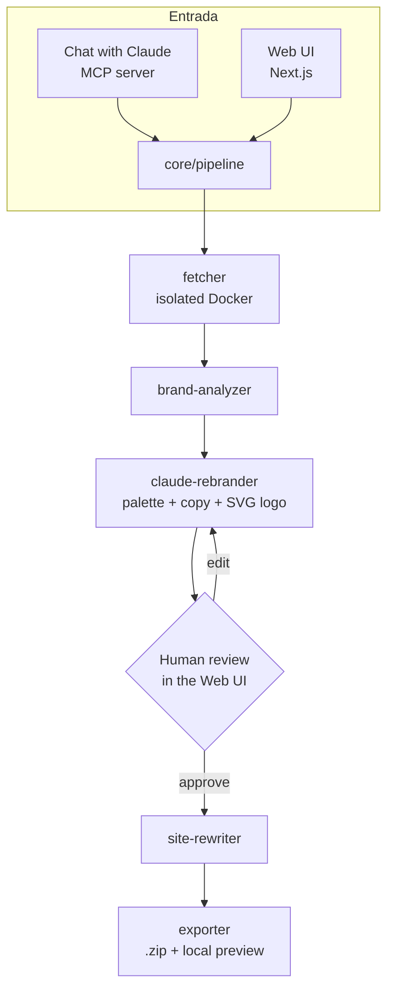

# Doppel MVP Implementation Plan

> **For agentic workers:** REQUIRED SUB-SKILL: Use superpowers:subagent-driven-development (recommended) or superpowers:executing-plans to implement this plan task-by-task. Steps use checkbox (`- [ ]`) syntax for tracking.

**Goal:** Build Doppel — a local-only tool that clones a website (URL in) and produces an AI-rebranded version (new logo/colors/copy) with high visual fidelity, usable either through a Next.js web UI or directly from a chat with Claude via an MCP server.

**Architecture:** npm-workspaces monorepo with a shared `core/` pipeline library (fetch → brand-analyze → Claude-rebrand → rewrite → export), a one-shot Docker container (`renderer/`) that performs all untrusted third-party fetching/rendering in isolation, an `mcp-server/` exposing the pipeline as Claude tools (with a startup ASCII banner + environment bootstrap), and a `web/` Next.js app that is the actual review/preview/export surface. All four share one SQLite database (`CloneJob` table) via Prisma.

**Tech Stack:** TypeScript, Node 20, npm workspaces, Cheerio, Playwright, Docker, Prisma + SQLite, `@modelcontextprotocol/sdk`, `@anthropic-ai/sdk`, Next.js 15 + Tailwind, Vitest.

**Spec:** `docs/superpowers/specs/2026-09-14-doppel-design.md`

## Global Constraints

- 100% local execution — no hosted backend, no cost borne by the project author (spec §1).
- Fetch/render of third-party URLs happens only inside the isolated `doppel-renderer` Docker container, never directly in `core`/`mcp-server`/`web` processes (spec §4.1).
- Multi-page crawl caps at **20 pages** per job, same-domain only, respects `robots.txt` (spec §3).
- `site-rewriter` performs surgical replacements on the original HTML/CSS — never regenerates the site from scratch (spec §3).
- Logo generation is SVG text generated by Claude — no paid image-generation API (spec §5).
- Every `CloneJob` stage updates `status`; failures set `status = "erro"` + `errorReason`, never throw unhandled (spec §8).
- MCP banner is the ported VØLK // BLACKGATE wolf ANSI art from `Documents/volk-signature-cmd/volk.ps1`, reimplemented in portable Node (raw ANSI escapes, not a shelled-out `.ps1` call) so it works on macOS/Linux too (spec §7).
- No Docker build/run step can be assumed to succeed non-interactively on every host (Windows may need elevation) — bootstrap must degrade to a clear manual instruction, never crash (spec §7, §8).

---

## Task 1: Monorepo scaffolding + Prisma schema + DB client

**Files:**
- Create: `package.json` (root, workspaces: `core`, `mcp-server`, `web`, `renderer`)
- Create: `tsconfig.base.json`
- Create: `.gitignore`
- Create: `core/package.json`, `core/tsconfig.json`
- Create: `prisma/schema.prisma`
- Create: `core/src/db.ts`
- Test: `core/src/db.test.ts`

**Interfaces:**
- Produces: `import { prisma } from '../db'` → a singleton `PrismaClient`; `CloneJob` model with fields `id, sourceUrl, brandName, niche, status, errorReason, colorPalette, copyChanges, logoSvg, previewPath, exportPath, createdAt, updatedAt` (all `String`/`String?`/`DateTime` per spec §4.2, `status` stored as plain string, no enum).

- [ ] **Step 1: Create root workspace config**

`package.json`:
```json
{
  "name": "doppel",
  "private": true,
  "workspaces": ["core", "mcp-server", "web", "renderer"],
  "scripts": {
    "build": "npm run build --workspaces --if-present",
    "test": "npm run test --workspaces --if-present"
  },
  "devDependencies": {
    "typescript": "^5.6.0",
    "vitest": "^2.1.0",
    "prisma": "^5.20.0"
  }
}
```

`tsconfig.base.json`:
```json
{
  "compilerOptions": {
    "target": "ES2022",
    "module": "NodeNext",
    "moduleResolution": "NodeNext",
    "strict": true,
    "esModuleInterop": true,
    "skipLibCheck": true,
    "declaration": true,
    "outDir": "dist"
  }
}
```

`.gitignore`:
```
node_modules/
dist/
*.db
*.db-journal
.env
/tmp-jobs/
```

- [ ] **Step 2: Write the Prisma schema**

`prisma/schema.prisma`:
```prisma
generator client {
  provider = "prisma-client-js"
  output   = "../core/generated/prisma"
}

datasource db {
  provider = "sqlite"
  url      = env("DOPPEL_DB_URL")
}

model CloneJob {
  id            String   @id @default(cuid())
  sourceUrl     String
  brandName     String
  niche         String?
  status        String
  errorReason   String?
  brandProfile  String?  // JSON BrandProfile (logoSrc, dominantColors, brandName) captured from the source site — Task 11 needs this at apply-time, not just the Claude output
  colorPalette  String?
  copyChanges   String?
  logoSvg       String?
  previewPath   String?
  exportPath    String?
  createdAt     DateTime @default(now())
  updatedAt     DateTime @updatedAt
}
```

- [ ] **Step 3: Create `core` package and DB client**

`core/package.json`:
```json
{
  "name": "@doppel/core",
  "version": "0.1.0",
  "type": "module",
  "main": "dist/index.js",
  "exports": {
    ".": "./dist/index.js",
    "./*": "./dist/*"
  },
  "scripts": {
    "build": "tsc -p tsconfig.json",
    "test": "vitest run"
  },
  "dependencies": {
    "@prisma/client": "^5.20.0"
  }
}
```

The `"./*": "./dist/*"` wildcard is what makes deep imports elsewhere in this plan (e.g. `@doppel/core/pipeline/index.js` in `mcp-server` and `web`, `@doppel/core/fetcher/crawl.js` in `renderer`) resolve to the compiled `core/dist/...` output instead of the nonexistent `core/pipeline/index.js` at the package root — without it, only the bare `@doppel/core` specifier would resolve correctly.

`core/tsconfig.json`:
```json
{
  "extends": "../tsconfig.base.json",
  "compilerOptions": { "rootDir": "src" },
  "include": ["src"]
}
```

`core/src/db.ts`:
```typescript
import { PrismaClient } from '../generated/prisma/index.js';

declare global {
  var __doppelPrisma: PrismaClient | undefined;
}

export function createPrismaClient(): PrismaClient {
  return new PrismaClient();
}

export const prisma: PrismaClient = globalThis.__doppelPrisma ?? createPrismaClient();

if (process.env.NODE_ENV !== 'production') {
  globalThis.__doppelPrisma = prisma;
}
```

`core/src/index.ts` (barrel — every consumer elsewhere in this plan uses the deep subpaths instead, e.g. `@doppel/core/pipeline/index.js`, but the package's own `"main"`/`"."` export must still point at a real file rather than a nonexistent `dist/index.js`):
```typescript
export * from './db.js';
```

- [ ] **Step 4: Write the failing test**

`core/src/db.test.ts`:
```typescript
import { describe, it, expect, beforeAll, afterAll } from 'vitest';
import { prisma } from './db.js';

describe('CloneJob DB', () => {
  afterAll(async () => {
    await prisma.$disconnect();
  });

  it('creates and reads back a CloneJob', async () => {
    const job = await prisma.cloneJob.create({
      data: {
        sourceUrl: 'https://example.com',
        brandName: 'Acme',
        status: 'fetching',
      },
    });

    const found = await prisma.cloneJob.findUnique({ where: { id: job.id } });
    expect(found?.sourceUrl).toBe('https://example.com');
    expect(found?.status).toBe('fetching');
  });
});
```

- [ ] **Step 5: Set up local SQLite DB and run the test**

Run:
```bash
npm install
DOPPEL_DB_URL="file:../doppel-dev.db" npx prisma migrate dev --name init --schema prisma/schema.prisma
DOPPEL_DB_URL="file:../doppel-dev.db" npm test -w core
```
Expected: `db.test.ts` passes (1 passed).

- [ ] **Step 6: Commit**

```bash
git add package.json tsconfig.base.json .gitignore prisma core/package.json core/tsconfig.json core/src/db.ts core/src/db.test.ts core/src/index.ts prisma/migrations
git commit -m "chore: scaffold monorepo and CloneJob schema"
```

---

## Task 2: core/fetcher — single-page fetch with thin-content detection

**Files:**
- Create: `core/src/fetcher/single-page.ts`
- Test: `core/src/fetcher/single-page.test.ts`

**Interfaces:**
- Produces: `fetchStaticPage(url: string): Promise<{ html: string; isThin: boolean }>` — `isThin` is `true` when the page looks JS-dependent (heuristic below), signaling callers to use the Playwright fallback (Task 3).

- [ ] **Step 1: Write the failing test**

`core/src/fetcher/single-page.test.ts`:
```typescript
import { describe, it, expect, beforeAll, afterAll } from 'vitest';
import http from 'node:http';
import { fetchStaticPage } from './single-page.js';

describe('fetchStaticPage', () => {
  let server: http.Server;
  let baseUrl: string;

  beforeAll(async () => {
    server = http.createServer((req, res) => {
      if (req.url === '/static') {
        res.end('<html><body><h1>Hello</h1><p>Real content here, plenty of it to read.</p></body></html>');
      } else if (req.url === '/spa') {
        res.end('<html><body><div id="root"></div><script src="/app.js"></script></body></html>');
      }
    });
    await new Promise<void>((resolve) => server.listen(0, resolve));
    const address = server.address();
    baseUrl = `http://127.0.0.1:${typeof address === 'object' && address ? address.port : 0}`;
  });

  afterAll(() => server.close());

  it('returns isThin=false for a static content page', async () => {
    const result = await fetchStaticPage(`${baseUrl}/static`);
    expect(result.isThin).toBe(false);
    expect(result.html).toContain('Hello');
  });

  it('returns isThin=true for a near-empty SPA shell', async () => {
    const result = await fetchStaticPage(`${baseUrl}/spa`);
    expect(result.isThin).toBe(true);
  });
});
```

- [ ] **Step 2: Run test to verify it fails**

Run: `npm test -w core -- fetcher/single-page`
Expected: FAIL — `Cannot find module './single-page.js'`

- [ ] **Step 3: Implement**

`core/src/fetcher/single-page.ts`:
```typescript
import * as cheerio from 'cheerio';

const THIN_TEXT_THRESHOLD = 200;

export async function fetchStaticPage(url: string): Promise<{ html: string; isThin: boolean }> {
  const response = await fetch(url, {
    headers: { 'User-Agent': 'DoppelBot/0.1 (+https://github.com/V0LKBLACKGATE/doppel)' },
  });
  const html = await response.text();
  const $ = cheerio.load(html);
  const bodyText = $('body').text().replace(/\s+/g, ' ').trim();
  const scriptCount = $('script[src]').length;
  const isThin = bodyText.length < THIN_TEXT_THRESHOLD && scriptCount > 0;
  return { html, isThin };
}
```

- [ ] **Step 4: Run test to verify it passes**

Run: `npm test -w core -- fetcher/single-page`
Expected: PASS (2 passed)

- [ ] **Step 5: Commit**

```bash
git add core/src/fetcher/single-page.ts core/src/fetcher/single-page.test.ts
git commit -m "feat(core): static page fetch with thin-content detection"
```

---

## Task 3: core/fetcher — Playwright render fallback

**Files:**
- Create: `core/src/fetcher/rendered-page.ts`
- Test: `core/src/fetcher/rendered-page.test.ts`
- Modify: `core/package.json` (add `playwright` dependency)

**Interfaces:**
- Consumes: nothing from Task 2 directly (independent module), but is called by the crawl orchestrator (Task 4) whenever `fetchStaticPage(...).isThin === true`.
- Produces: `fetchRenderedPage(url: string, timeoutMs?: number): Promise<{ html: string }>`.

- [ ] **Step 1: Add Playwright dependency**

```bash
npm install -w core playwright
npx playwright install chromium
```

- [ ] **Step 2: Write the failing test**

`core/src/fetcher/rendered-page.test.ts`:
```typescript
import { describe, it, expect, beforeAll, afterAll } from 'vitest';
import http from 'node:http';
import { fetchRenderedPage } from './rendered-page.js';

describe('fetchRenderedPage', () => {
  let server: http.Server;
  let baseUrl: string;

  beforeAll(async () => {
    server = http.createServer((req, res) => {
      res.setHeader('Content-Type', 'text/html');
      res.end(`<html><body><div id="root"></div><script>
        document.getElementById('root').innerHTML = '<h1>Rendered</h1>';
      </script></body></html>`);
    });
    await new Promise<void>((resolve) => server.listen(0, resolve));
    const address = server.address();
    baseUrl = `http://127.0.0.1:${typeof address === 'object' && address ? address.port : 0}`;
  });

  afterAll(() => server.close());

  it('returns the DOM after JS execution', async () => {
    const result = await fetchRenderedPage(baseUrl);
    expect(result.html).toContain('Rendered');
  }, 20000);
});
```

- [ ] **Step 3: Run test to verify it fails**

Run: `npm test -w core -- fetcher/rendered-page`
Expected: FAIL — `Cannot find module './rendered-page.js'`

- [ ] **Step 4: Implement**

`core/src/fetcher/rendered-page.ts`:
```typescript
import { chromium } from 'playwright';

export async function fetchRenderedPage(url: string, timeoutMs = 30000): Promise<{ html: string }> {
  const browser = await chromium.launch();
  try {
    const page = await browser.newPage();
    await page.goto(url, { waitUntil: 'networkidle', timeout: timeoutMs });
    const html = await page.content();
    return { html };
  } finally {
    await browser.close();
  }
}
```

- [ ] **Step 5: Run test to verify it passes**

Run: `npm test -w core -- fetcher/rendered-page`
Expected: PASS (1 passed)

- [ ] **Step 6: Commit**

```bash
git add core/package.json core/src/fetcher/rendered-page.ts core/src/fetcher/rendered-page.test.ts
git commit -m "feat(core): headless render fallback via Playwright"
```

---

## Task 4: core/fetcher — multi-page crawl (robots.txt + same-domain, max 20 pages)

**Files:**
- Create: `core/src/fetcher/crawl.ts`
- Test: `core/src/fetcher/crawl.test.ts`
- Modify: `core/package.json` (add `robots-parser` dependency)

**Interfaces:**
- Consumes: `fetchStaticPage` (Task 2), `fetchRenderedPage` (Task 3).
- Produces:
  ```typescript
  export interface CrawledPage { url: string; html: string; usedRenderer: 'static' | 'headless'; }
  export interface CrawlResult { pages: CrawledPage[]; }
  export async function crawlSite(startUrl: string, maxPages?: number): Promise<CrawlResult>
  ```
  `maxPages` defaults to 20 (Global Constraints).

- [ ] **Step 1: Add dependency**

```bash
npm install -w core robots-parser
```

- [ ] **Step 2: Write the failing test**

`core/src/fetcher/crawl.test.ts`:
```typescript
import { describe, it, expect, beforeAll, afterAll } from 'vitest';
import http from 'node:http';
import { crawlSite } from './crawl.js';

describe('crawlSite', () => {
  let server: http.Server;
  let baseUrl: string;

  beforeAll(async () => {
    const pages: Record<string, string> = {
      '/robots.txt': 'User-agent: *\nDisallow: /private\n',
      '/': '<html><body><a href="/about">About</a><a href="/private">Private</a><a href="https://external.example/x">External</a></body></html>',
      '/about': '<html><body>About page content here for real.</body></html>',
      '/private': '<html><body>Should never be fetched.</body></html>',
    };
    server = http.createServer((req, res) => {
      const body = pages[req.url ?? ''];
      if (body) {
        res.setHeader('Content-Type', 'text/plain');
        res.end(body);
      } else {
        res.statusCode = 404;
        res.end();
      }
    });
    await new Promise<void>((resolve) => server.listen(0, resolve));
    const address = server.address();
    baseUrl = `http://127.0.0.1:${typeof address === 'object' && address ? address.port : 0}`;
  });

  afterAll(() => server.close());

  it('follows same-domain links, respects robots.txt, skips external links', async () => {
    const result = await crawlSite(baseUrl, 20);
    const urls = result.pages.map((p) => p.url);
    expect(urls).toContain(`${baseUrl}/`);
    expect(urls).toContain(`${baseUrl}/about`);
    expect(urls).not.toContain(`${baseUrl}/private`);
    expect(urls.every((u) => u.startsWith(baseUrl))).toBe(true);
  });

  it('caps the crawl at maxPages', async () => {
    const result = await crawlSite(baseUrl, 1);
    expect(result.pages.length).toBeLessThanOrEqual(1);
  });
});
```

- [ ] **Step 3: Run test to verify it fails**

Run: `npm test -w core -- fetcher/crawl`
Expected: FAIL — `Cannot find module './crawl.js'`

- [ ] **Step 4: Implement**

`core/src/fetcher/crawl.ts`:
```typescript
import * as cheerio from 'cheerio';
import robotsParser from 'robots-parser';
import { fetchStaticPage } from './single-page.js';
import { fetchRenderedPage } from './rendered-page.js';

export interface CrawledPage {
  url: string;
  html: string;
  usedRenderer: 'static' | 'headless';
}

export interface CrawlResult {
  pages: CrawledPage[];
}

export async function crawlSite(startUrl: string, maxPages = 20): Promise<CrawlResult> {
  const origin = new URL(startUrl).origin;
  const robots = await loadRobots(origin);

  const visited = new Set<string>();
  const queue: string[] = [normalize(startUrl)];
  const pages: CrawledPage[] = [];

  while (queue.length > 0 && pages.length < maxPages) {
    const url = queue.shift()!;
    if (visited.has(url)) continue;
    visited.add(url);
    if (!robots.isAllowed(url, 'DoppelBot')) continue;

    const { html, isThin } = await fetchStaticPage(url);
    const finalHtml = isThin ? (await fetchRenderedPage(url)).html : html;
    pages.push({ url, html: finalHtml, usedRenderer: isThin ? 'headless' : 'static' });

    for (const link of extractSameDomainLinks(finalHtml, url, origin)) {
      if (!visited.has(link)) queue.push(link);
    }
  }

  return { pages };
}

async function loadRobots(origin: string) {
  try {
    const res = await fetch(`${origin}/robots.txt`);
    const body = res.ok ? await res.text() : '';
    return robotsParser(`${origin}/robots.txt`, body);
  } catch {
    return robotsParser(`${origin}/robots.txt`, '');
  }
}

function extractSameDomainLinks(html: string, pageUrl: string, origin: string): string[] {
  const $ = cheerio.load(html);
  const links: string[] = [];
  $('a[href]').each((_, el) => {
    const href = $(el).attr('href');
    if (!href) return;
    try {
      const resolved = new URL(href, pageUrl);
      if (resolved.origin === origin) links.push(normalize(resolved.toString()));
    } catch {
      // ignore malformed hrefs
    }
  });
  return links;
}

function normalize(url: string): string {
  const u = new URL(url);
  u.hash = '';
  return u.toString();
}
```

- [ ] **Step 5: Run test to verify it passes**

Run: `npm test -w core -- fetcher/crawl`
Expected: PASS (2 passed)

- [ ] **Step 6: Commit**

```bash
git add core/package.json core/src/fetcher/crawl.ts core/src/fetcher/crawl.test.ts
git commit -m "feat(core): multi-page same-domain crawl with robots.txt"
```

---

## Task 5: renderer/ — Dockerfile + CLI entrypoint (isolated crawl container)

**Files:**
- Create: `renderer/package.json`, `renderer/tsconfig.json`
- Create: `renderer/src/cli.ts`
- Create: `renderer/Dockerfile`
- Create: `.dockerignore` (repo root)
- Test: `renderer/src/cli.test.ts` (fixture-server smoke test of the CLI, run directly with Node — Docker build/run is verified manually in Task 5 Step 6, not inside the automated test suite, since the sandbox executing this plan may not have Docker available)

**Interfaces:**
- Consumes: `crawlSite` (Task 4) via the `@doppel/core` workspace package.
- Produces: a CLI (`node dist/cli.js --url <url> --maxPages <n> --out <dir>`) that writes `<dir>/manifest.json` (`{ pages: [{ url, htmlPath, usedRenderer }] }`), one `.html` file per page under `<dir>/pages/` (rewritten to reference localized assets by relative path), and downloaded ``/`<link rel=stylesheet>`/`<script src>` assets under `<dir>/assets/` — this is what lets the exported `.zip` and local preview render for real, offline, instead of pointing back at the original site. Exit code `0` on success, `1` on failure with an error message on stderr.

- [ ] **Step 1: Create the renderer package**

`renderer/package.json`:
```json
{
  "name": "@doppel/renderer",
  "version": "0.1.0",
  "type": "module",
  "scripts": {
    "build": "tsc -p tsconfig.json",
    "test": "vitest run"
  },
  "dependencies": {
    "@doppel/core": "*"
  }
}
```

`renderer/tsconfig.json`:
```json
{
  "extends": "../tsconfig.base.json",
  "compilerOptions": { "rootDir": "src" },
  "include": ["src"]
}
```

- [ ] **Step 2: Write the failing test**

`renderer/src/cli.test.ts`:
```typescript
import { describe, it, expect, beforeAll, afterAll } from 'vitest';
import http from 'node:http';
import fs from 'node:fs';
import os from 'node:os';
import path from 'node:path';
import { execFile } from 'node:child_process';
import { promisify } from 'node:util';
import { runCrawlCli } from './cli.js';

const execFileAsync = promisify(execFile);

describe('runCrawlCli', () => {
  let server: http.Server;
  let baseUrl: string;
  let outDir: string;

  beforeAll(async () => {
    server = http.createServer((req, res) => {
      if (req.url === '/style.css') {
        res.setHeader('Content-Type', 'text/css');
        res.end('body { color: #1B7964; }');
        return;
      }
      res.end(
        '<html><head><link rel="stylesheet" href="/style.css"></head><body><h1>Fixture page with enough text to not be thin.</h1></body></html>',
      );
    });
    await new Promise<void>((resolve) => server.listen(0, resolve));
    const address = server.address();
    baseUrl = `http://127.0.0.1:${typeof address === 'object' && address ? address.port : 0}`;
    outDir = fs.mkdtempSync(path.join(os.tmpdir(), 'doppel-cli-'));
  });

  afterAll(() => {
    server.close();
    fs.rmSync(outDir, { recursive: true, force: true });
  });

  it('writes manifest.json, page HTML files, and localizes linked assets', async () => {
    await runCrawlCli({ url: baseUrl, maxPages: 5, outDir });

    const manifest = JSON.parse(fs.readFileSync(path.join(outDir, 'manifest.json'), 'utf-8'));
    expect(manifest.pages.length).toBeGreaterThan(0);
    const firstPagePath = path.join(outDir, manifest.pages[0].htmlPath);
    const pageHtml = fs.readFileSync(firstPagePath, 'utf-8');
    expect(pageHtml).toContain('Fixture page');
    expect(pageHtml).toMatch(/href="\.\.\/assets\/[^"]+\.css"/);

    const assetFiles = fs.readdirSync(path.join(outDir, 'assets'));
    expect(assetFiles.length).toBeGreaterThan(0);
    const cssContent = fs.readFileSync(path.join(outDir, 'assets', assetFiles[0]), 'utf-8');
    expect(cssContent).toContain('#1B7964');
  });
});
```

- [ ] **Step 3: Run test to verify it fails**

Run: `npm test -w renderer -- cli`
Expected: FAIL — `Cannot find module './cli.js'`

- [ ] **Step 4: Implement**

`renderer/src/cli.ts`:
```typescript
import fs from 'node:fs';
import path from 'node:path';
import crypto from 'node:crypto';
import * as cheerio from 'cheerio';
import { crawlSite } from '@doppel/core/fetcher/crawl.js';

export interface CrawlCliArgs {
  url: string;
  maxPages: number;
  outDir: string;
}

const ASSET_SELECTORS: { selector: string; attr: string }[] = [
  { selector: 'link[rel="stylesheet"]', attr: 'href' },
  { selector: 'script[src]', attr: 'src' },
  { selector: 'img[src]', attr: 'src' },
];

export async function runCrawlCli(args: CrawlCliArgs): Promise<void> {
  const { url, maxPages, outDir } = args;
  const pagesDir = path.join(outDir, 'pages');
  const assetsDir = path.join(outDir, 'assets');
  fs.mkdirSync(pagesDir, { recursive: true });
  fs.mkdirSync(assetsDir, { recursive: true });

  const { pages } = await crawlSite(url, maxPages);
  const downloaded = new Map<string, string>(); // absolute asset URL -> local file name

  const manifest = {
    pages: await Promise.all(
      pages.map(async (page, i) => {
        const localizedHtml = await localizeAssets(page.html, page.url, assetsDir, downloaded);
        const fileName = `page-${i}.html`;
        fs.writeFileSync(path.join(pagesDir, fileName), localizedHtml, 'utf-8');
        return { url: page.url, htmlPath: path.join('pages', fileName), usedRenderer: page.usedRenderer };
      }),
    ),
  };

  fs.writeFileSync(path.join(outDir, 'manifest.json'), JSON.stringify(manifest, null, 2), 'utf-8');
}

async function localizeAssets(
  html: string,
  pageUrl: string,
  assetsDir: string,
  downloaded: Map<string, string>,
): Promise<string> {
  const $ = cheerio.load(html);

  for (const { selector, attr } of ASSET_SELECTORS) {
    const elements = $(selector).toArray();
    for (const el of elements) {
      const raw = $(el).attr(attr);
      if (!raw) continue;
      let absoluteUrl: string;
      try {
        absoluteUrl = new URL(raw, pageUrl).toString();
      } catch {
        continue;
      }

      if (!downloaded.has(absoluteUrl)) {
        try {
          const res = await fetch(absoluteUrl);
          const buffer = Buffer.from(await res.arrayBuffer());
          const ext = path.extname(new URL(absoluteUrl).pathname) || guessExt(res.headers.get('content-type'));
          const localName = `${crypto.createHash('sha1').update(absoluteUrl).digest('hex')}${ext}`;
          fs.writeFileSync(path.join(assetsDir, localName), buffer);
          downloaded.set(absoluteUrl, localName);
        } catch {
          continue; // asset unreachable — leave the original attr untouched below
        }
      }

      const localName = downloaded.get(absoluteUrl);
      if (localName) $(el).attr(attr, `../assets/${localName}`);
    }
  }

  return $.html();
}

function guessExt(contentType: string | null): string {
  if (!contentType) return '.bin';
  if (contentType.includes('css')) return '.css';
  if (contentType.includes('javascript')) return '.js';
  if (contentType.includes('svg')) return '.svg';
  if (contentType.includes('png')) return '.png';
  if (contentType.includes('jpeg')) return '.jpg';
  return '.bin';
}

function parseArgs(argv: string[]): CrawlCliArgs {
  const get = (flag: string) => {
    const i = argv.indexOf(flag);
    if (i === -1 || i + 1 >= argv.length) throw new Error(`Missing ${flag}`);
    return argv[i + 1];
  };
  return { url: get('--url'), maxPages: Number(get('--maxPages')), outDir: get('--out') };
}

if (import.meta.url === `file://${process.argv[1]}`) {
  runCrawlCli(parseArgs(process.argv.slice(2)))
    .then(() => process.exit(0))
    .catch((err) => {
      console.error(err instanceof Error ? err.message : String(err));
      process.exit(1);
    });
}
```

- [ ] **Step 5: Run test to verify it passes**

Run: `npm test -w renderer -- cli`
Expected: PASS (1 passed)

- [ ] **Step 6: Write the Dockerfile and verify the build manually**

`.dockerignore` (repo root — keeps the build context small and avoids shipping stale local builds into the image):
```
node_modules
**/node_modules
**/dist
tmp-jobs
*.db
.git
```

`renderer/Dockerfile`:
```dockerfile
FROM mcr.microsoft.com/playwright:v1.47.0-jammy

WORKDIR /app
COPY . .
RUN npm install
RUN npm run build -w core && npm run build -w renderer

ENTRYPOINT ["node", "renderer/dist/cli.js"]
```

The root `package.json` lists all four workspaces (`core`, `mcp-server`, `web`, `renderer`) — `npm install` needs every listed workspace directory to actually exist with its own `package.json`, so the Dockerfile copies the whole repo (`COPY . .`) rather than cherry-picking `core`/`renderer`; building only those two workspaces afterward keeps the image from needing `web`'s or `mcp-server`'s dependencies installed.

Run (manual verification, requires Docker running locally — not part of the automated test suite):
```bash
docker build -f renderer/Dockerfile -t doppel-renderer:dev .
docker run --rm -v "$(pwd)/tmp-jobs/smoke:/data" doppel-renderer:dev --url https://example.com --maxPages 1 --out /data
```
Expected: exit code 0, `tmp-jobs/smoke/manifest.json` created on the host.

- [ ] **Step 7: Commit**

```bash
git add renderer package.json .dockerignore
git commit -m "feat(renderer): dockerized crawl CLI"
```

---

## Task 6: core/fetcher — Docker orchestration wrapper

**Files:**
- Create: `core/src/fetcher/docker-fetch.ts`
- Test: `core/src/fetcher/docker-fetch.test.ts`

**Interfaces:**
- Consumes: `child_process.spawn` (mocked in tests), the `doppel-renderer` image built in Task 5.
- Produces:
  ```typescript
  export interface DockerFetchResult {
    workDir: string; // contains pages/*.html and assets/* on disk — site-rewriter (Task 9) and exporter (Task 10) read/write here directly
    pages: { url: string; html: string; usedRenderer: 'static' | 'headless' }[];
  }
  export async function fetchSiteViaDocker(url: string, maxPages: number, opts?: { spawnFn?: typeof import('node:child_process').spawn; workDir?: string }): Promise<DockerFetchResult>
  ```
  Throws `DockerUnavailableError` (a named `Error` subclass) if `docker` exits non-zero or is not found — callers (Task 11 pipeline) catch this to set `CloneJob.status = 'erro'`.

- [ ] **Step 1: Write the failing test**

`core/src/fetcher/docker-fetch.test.ts`:
```typescript
import { describe, it, expect, vi } from 'vitest';
import fs from 'node:fs';
import os from 'node:os';
import path from 'node:path';
import { EventEmitter } from 'node:events';
import { fetchSiteViaDocker, DockerUnavailableError } from './docker-fetch.js';

function fakeSpawn(exitCode: number, onSpawn?: (args: string[]) => void) {
  return vi.fn((_cmd: string, args: string[]) => {
    onSpawn?.(args);
    const child = new EventEmitter() as any;
    child.stdout = new EventEmitter();
    child.stderr = new EventEmitter();
    setTimeout(() => child.emit('close', exitCode), 0);
    return child;
  });
}

describe('fetchSiteViaDocker', () => {
  it('runs docker with a volume mount and parses the manifest written by the container', async () => {
    const workDir = fs.mkdtempSync(path.join(os.tmpdir(), 'doppel-docker-'));
    let capturedArgs: string[] = [];
    const spawnFn = fakeSpawn(0, (args) => {
      capturedArgs = args;
      const mountArg = args.find((a) => a.includes(':/data'));
      const hostDir = mountArg?.split(':')[0] ?? '';
      fs.mkdirSync(path.join(hostDir, 'pages'), { recursive: true });
      fs.writeFileSync(path.join(hostDir, 'pages', 'page-0.html'), '<html>ok</html>');
      fs.writeFileSync(
        path.join(hostDir, 'manifest.json'),
        JSON.stringify({ pages: [{ url: 'https://example.com', htmlPath: 'pages/page-0.html', usedRenderer: 'static' }] }),
      );
    });

    const result = await fetchSiteViaDocker('https://example.com', 20, { spawnFn: spawnFn as any, workDir });

    expect(result.workDir).toBe(workDir);
    expect(result.pages).toHaveLength(1);
    expect(result.pages[0].html).toBe('<html>ok</html>');
    expect(capturedArgs).toContain('doppel-renderer');
    expect(capturedArgs.join(' ')).toContain('--maxPages 20');
  });

  it('throws DockerUnavailableError when docker exits non-zero', async () => {
    const workDir = fs.mkdtempSync(path.join(os.tmpdir(), 'doppel-docker-'));
    const spawnFn = fakeSpawn(1);
    await expect(fetchSiteViaDocker('https://example.com', 20, { spawnFn: spawnFn as any, workDir })).rejects.toBeInstanceOf(
      DockerUnavailableError,
    );
  });
});
```

- [ ] **Step 2: Run test to verify it fails**

Run: `npm test -w core -- fetcher/docker-fetch`
Expected: FAIL — `Cannot find module './docker-fetch.js'`

- [ ] **Step 3: Implement**

`core/src/fetcher/docker-fetch.ts`:
```typescript
import { spawn as nodeSpawn } from 'node:child_process';
import fs from 'node:fs';
import os from 'node:os';
import path from 'node:path';

export class DockerUnavailableError extends Error {}

export interface DockerFetchResult {
  pages: { url: string; html: string; usedRenderer: 'static' | 'headless' }[];
}

export async function fetchSiteViaDocker(
  url: string,
  maxPages: number,
  opts: { spawnFn?: typeof nodeSpawn; workDir?: string } = {},
): Promise<DockerFetchResult> {
  const spawnFn = opts.spawnFn ?? nodeSpawn;
  const workDir = opts.workDir ?? fs.mkdtempSync(path.join(os.tmpdir(), 'doppel-job-'));

  await new Promise<void>((resolve, reject) => {
    const child = spawnFn('docker', [
      'run',
      '--rm',
      '-v',
      `${workDir}:/data`,
      'doppel-renderer',
      '--url',
      url,
      '--maxPages',
      String(maxPages),
      '--out',
      '/data',
    ]);
    child.on('error', () => reject(new DockerUnavailableError('docker binary not found')));
    child.on('close', (code: number) => {
      if (code === 0) resolve();
      else reject(new DockerUnavailableError(`docker exited with code ${code}`));
    });
  });

  const manifestPath = path.join(workDir, 'manifest.json');
  const manifest = JSON.parse(fs.readFileSync(manifestPath, 'utf-8')) as {
    pages: { url: string; htmlPath: string; usedRenderer: 'static' | 'headless' }[];
  };

  return {
    workDir,
    pages: manifest.pages.map((p) => ({
      url: p.url,
      usedRenderer: p.usedRenderer,
      html: fs.readFileSync(path.join(workDir, p.htmlPath), 'utf-8'),
    })),
  };
}
```

- [ ] **Step 4: Run test to verify it passes**

Run: `npm test -w core -- fetcher/docker-fetch`
Expected: PASS (2 passed)

- [ ] **Step 5: Commit**

```bash
git add core/src/fetcher/docker-fetch.ts core/src/fetcher/docker-fetch.test.ts
git commit -m "feat(core): docker orchestration wrapper for isolated fetch"
```

---

## Task 7: core/brand-analyzer — logo, color palette, brand name detection

**Files:**
- Create: `core/src/brand-analyzer/index.ts`
- Test: `core/src/brand-analyzer/index.test.ts`

**Interfaces:**
- Consumes: page HTML from `DockerFetchResult.pages` (Task 6) — note these are the **already-localized** pages the renderer wrote (Task 5 rewrote `img`/`link`/`script` attributes to relative paths like `../assets/<hash>.svg`). `analyzeBrand` must not attempt to resolve those as absolute URLs — it returns the attribute value verbatim so Task 9 (site-rewriter) can match it exactly against the same file.
- Produces:
  ```typescript
  export interface BrandProfile {
    logoSrc: string | null; // raw src attribute value, unresolved (e.g. "../assets/<hash>.svg")
    dominantColors: string[]; // hex, most-frequent first, max 5
    brandName: string | null;
  }
  export function analyzeBrand(pages: { url: string; html: string }[]): BrandProfile
  ```

- [ ] **Step 1: Write the failing test**

`core/src/brand-analyzer/index.test.ts`:
```typescript
import { describe, it, expect } from 'vitest';
import { analyzeBrand } from './index.js';

const fixtureHtml = `
<html>
<head>
  <title>Acme Rockets</title>
  <meta property="og:site_name" content="Acme Rockets" />
  <style>
    .hero { background: #1B7964; }
    .cta { color: #1B7964; }
    .footer { background: #1B7964; }
  </style>
</head>
<body>
  <header></header>
  <main><h1 style="color:#31C99D">Welcome to Acme Rockets</h1></main>
  <footer>&copy; 2026 Acme Rockets</footer>
</body>
</html>`;

describe('analyzeBrand', () => {
  it('detects the logo image (as the raw, already-localized src), dominant color, and brand name', () => {
    const profile = analyzeBrand([{ url: 'https://acme.example', html: fixtureHtml }]);
    expect(profile.logoSrc).toBe('../assets/a1b2c3.svg');
    expect(profile.dominantColors[0]).toBe('#1b7964');
    expect(profile.brandName).toBe('Acme Rockets');
  });
});
```

- [ ] **Step 2: Run test to verify it fails**

Run: `npm test -w core -- brand-analyzer`
Expected: FAIL — `Cannot find module './index.js'`

- [ ] **Step 3: Implement**

`core/src/brand-analyzer/index.ts`:
```typescript
import * as cheerio from 'cheerio';

export interface BrandProfile {
  logoSrc: string | null;
  dominantColors: string[];
  brandName: string | null;
}

const HEX_COLOR_RE = /#[0-9a-fA-F]{6}\b/g;
const NEAR_WHITE_BLACK = new Set(['#ffffff', '#000000']);

export function analyzeBrand(pages: { url: string; html: string }[]): BrandProfile {
  let logoSrc: string | null = null;
  let brandName: string | null = null;
  const colorCounts = new Map<string, number>();

  for (const page of pages) {
    const $ = cheerio.load(page.html);

    if (!logoSrc) {
      const logoImg = $('header img[src], img[alt*="logo" i], img.logo, img[src*="logo" i]').first();
      logoSrc = logoImg.attr('src') ?? null;
    }

    if (!brandName) {
      brandName = $('meta[property="og:site_name"]').attr('content')?.trim() || $('title').first().text().trim() || null;
    }

    const styleText = $('style').text() + ' ' + $('[style]').toArray().map((el) => $(el).attr('style')).join(' ');
    for (const match of styleText.matchAll(HEX_COLOR_RE)) {
      const hex = match[0].toLowerCase();
      if (NEAR_WHITE_BLACK.has(hex)) continue;
      colorCounts.set(hex, (colorCounts.get(hex) ?? 0) + 1);
    }
  }

  const dominantColors = [...colorCounts.entries()]
    .sort((a, b) => b[1] - a[1])
    .slice(0, 5)
    .map(([hex]) => hex);

  return { logoSrc, dominantColors, brandName };
}
```

- [ ] **Step 4: Run test to verify it passes**

Run: `npm test -w core -- brand-analyzer`
Expected: PASS (1 passed)

- [ ] **Step 5: Commit**

```bash
git add core/src/brand-analyzer
git commit -m "feat(core): brand-analyzer for logo/color/name detection"
```

---

## Task 8: core/claude-rebrander — Claude generates palette, copy, and SVG logo

**Files:**
- Create: `core/src/claude-rebrander/index.ts`
- Test: `core/src/claude-rebrander/index.test.ts`
- Modify: `core/package.json` (add `@anthropic-ai/sdk`)

**Interfaces:**
- Consumes: `BrandProfile` (Task 7), raw page HTML (for copy excerpt extraction).
- Produces:
  ```typescript
  export interface RebrandResult {
    colorPalette: string[]; // hex, same length/order as BrandProfile.dominantColors — index i replaces dominantColors[i]
    copyChanges: Record<string, string>; // original text -> rewritten text, exact match
    logoSvg: string; // raw <svg>...</svg> markup
  }
  export function extractCopyExcerpts(pages: { html: string }[], max?: number): string[]
  export async function rebrandSite(
    profile: BrandProfile,
    copyExcerpts: string[],
    brandName: string,
    niche: string | undefined,
    opts?: { client?: import('@anthropic-ai/sdk').default },
  ): Promise<RebrandResult>
  ```
  Throws `RebrandParseError` if Claude's response doesn't contain a valid `submit_rebrand` tool call.

- [ ] **Step 1: Add dependency**

```bash
npm install -w core @anthropic-ai/sdk
```

- [ ] **Step 2: Write the failing test**

`core/src/claude-rebrander/index.test.ts`:
```typescript
import { describe, it, expect, vi } from 'vitest';
import { extractCopyExcerpts, rebrandSite, RebrandParseError } from './index.js';
import type { BrandProfile } from '../brand-analyzer/index.js';

const profile: BrandProfile = {
  logoSrc: '../assets/logo.svg',
  dominantColors: ['#1b7964'],
  brandName: 'Acme Rockets',
};

function fakeClient(toolInput: unknown, useToolUse = true) {
  return {
    messages: {
      create: vi.fn().mockResolvedValue({
        content: useToolUse ? [{ type: 'tool_use', name: 'submit_rebrand', input: toolInput }] : [{ type: 'text', text: 'oops' }],
      }),
    },
  } as any;
}

describe('extractCopyExcerpts', () => {
  it('pulls headline and CTA text, deduped, capped at max', () => {
    const pages = [{ html: '<h1>Welcome</h1><h1>Welcome</h1><button>Buy now</button>' }];
    const excerpts = extractCopyExcerpts(pages, 10);
    expect(excerpts).toEqual(['Welcome', 'Buy now']);
  });
});

describe('rebrandSite', () => {
  it('parses a well-formed tool_use response into a RebrandResult', async () => {
    const client = fakeClient({
      colorPalette: ['#7c3aed'],
      copyChanges: { Welcome: 'Bem-vindo' },
      logoSvg: '<svg><text>SR</text></svg>',
    });

    const result = await rebrandSite(profile, ['Welcome'], 'Sorriso+', 'clínica odontológica', { client });

    expect(result.colorPalette).toEqual(['#7c3aed']);
    expect(result.copyChanges.Welcome).toBe('Bem-vindo');
    expect(result.logoSvg).toContain('<svg>');
    expect(client.messages.create).toHaveBeenCalledTimes(1);
    const callArgs = client.messages.create.mock.calls[0][0];
    expect(JSON.stringify(callArgs)).toContain('Sorriso+');
    expect(JSON.stringify(callArgs)).toContain('clínica odontológica');
  });

  it('throws RebrandParseError when Claude does not return the expected tool call', async () => {
    const client = fakeClient({}, false);
    await expect(rebrandSite(profile, ['Welcome'], 'Sorriso+', undefined, { client })).rejects.toBeInstanceOf(
      RebrandParseError,
    );
  });
});
```

- [ ] **Step 3: Run test to verify it fails**

Run: `npm test -w core -- claude-rebrander`
Expected: FAIL — `Cannot find module './index.js'`

- [ ] **Step 4: Implement**

`core/src/claude-rebrander/index.ts`:
```typescript
import Anthropic from '@anthropic-ai/sdk';
import * as cheerio from 'cheerio';
import type { BrandProfile } from '../brand-analyzer/index.js';

export interface RebrandResult {
  colorPalette: string[];
  copyChanges: Record<string, string>;
  logoSvg: string;
}

export class RebrandParseError extends Error {}

const COPY_SELECTOR = 'h1, h2, h3, button, a.cta, a[class*="cta" i]';

export function extractCopyExcerpts(pages: { html: string }[], max = 20): string[] {
  const seen = new Set<string>();
  for (const page of pages) {
    const $ = cheerio.load(page.html);
    $(COPY_SELECTOR).each((_, el) => {
      const text = $(el).text().replace(/\s+/g, ' ').trim();
      if (text) seen.add(text);
    });
  }
  return [...seen].slice(0, max);
}

const REBRAND_TOOL = {
  name: 'submit_rebrand',
  description: 'Submit the rebrand decisions for a cloned site.',
  input_schema: {
    type: 'object' as const,
    properties: {
      colorPalette: { type: 'array', items: { type: 'string' } },
      copyChanges: { type: 'object', additionalProperties: { type: 'string' } },
      logoSvg: { type: 'string' },
    },
    required: ['colorPalette', 'copyChanges', 'logoSvg'],
  },
};

export async function rebrandSite(
  profile: BrandProfile,
  copyExcerpts: string[],
  brandName: string,
  niche: string | undefined,
  opts: { client?: Anthropic } = {},
): Promise<RebrandResult> {
  const client = opts.client ?? new Anthropic();

  const prompt = [
    `Nova marca: ${brandName}`,
    niche ? `Nicho: ${niche}` : null,
    `Paleta atual (hex, mais frequente primeiro): ${JSON.stringify(profile.dominantColors)}`,
    `Nome atual detectado: ${profile.brandName ?? 'desconhecido'}`,
    `Textos de marca/copy encontrados no site: ${JSON.stringify(copyExcerpts)}`,
    '',
    'Gere: (1) uma paleta de cores nova com o MESMO número de cores, na MESMA ordem (cada posição substitui a cor correspondente da paleta atual);',
    '(2) copyChanges mapeando CADA texto da lista de copy acima (chave, EXATAMENTE como aparece) para uma versão reescrita fazendo sentido para a nova marca/nicho;',
    '(3) um logo simples em SVG (viewBox 0 0 200 60, sem <script>, cores coerentes com a nova paleta) usando as iniciais ou o nome curto da marca.',
  ]
    .filter(Boolean)
    .join('\n');

  const response = await client.messages.create({
    model: 'claude-sonnet-5',
    max_tokens: 2048,
    tools: [REBRAND_TOOL],
    tool_choice: { type: 'tool', name: 'submit_rebrand' },
    messages: [{ role: 'user', content: prompt }],
  });

  const toolUse = response.content.find(
    (block: { type: string }): block is { type: 'tool_use'; input: unknown } => block.type === 'tool_use',
  );
  if (!toolUse) throw new RebrandParseError('Claude did not return a submit_rebrand tool call');

  return toolUse.input as RebrandResult;
}
```

- [ ] **Step 5: Run test to verify it passes**

Run: `npm test -w core -- claude-rebrander`
Expected: PASS (3 passed)

- [ ] **Step 6: Commit**

```bash
git add core/package.json core/src/claude-rebrander
git commit -m "feat(core): claude-rebrander for palette/copy/logo generation"
```

---

## Task 9: core/site-rewriter — surgical logo/color/copy replacement

**Files:**
- Create: `core/src/site-rewriter/index.ts`
- Test: `core/src/site-rewriter/index.test.ts`
- Modify: `core/package.json` (add `fs-extra` for recursive copy — or use `fs.cpSync`, Node 20 has it natively, so no new dependency needed)

**Interfaces:**
- Consumes: `workDir` (from `DockerFetchResult`, Task 6, containing `pages/`, `assets/`, `manifest.json`), `BrandProfile` (Task 7), `RebrandResult` (Task 8).
- Produces: `export async function rewriteSite(workDir: string, profile: BrandProfile, rebrand: RebrandResult): Promise<{ rewrittenDir: string }>` — writes a full copy under `<workDir>/rewritten/` (same `pages/`, `assets/`, `manifest.json` layout) with the logo swapped, dominant colors replaced (across HTML and any `.css` asset files), and every `copyChanges` key replaced by its value wherever it appears as page text.

- [ ] **Step 1: Write the failing test**

`core/src/site-rewriter/index.test.ts`:
```typescript
import { describe, it, expect, beforeAll, afterAll } from 'vitest';
import fs from 'node:fs';
import os from 'node:os';
import path from 'node:path';
import { rewriteSite } from './index.js';
import type { BrandProfile } from '../brand-analyzer/index.js';
import type { RebrandResult } from '../claude-rebrander/index.js';

describe('rewriteSite', () => {
  let workDir: string;

  beforeAll(() => {
    workDir = fs.mkdtempSync(path.join(os.tmpdir(), 'doppel-rewrite-'));
    fs.mkdirSync(path.join(workDir, 'pages'), { recursive: true });
    fs.mkdirSync(path.join(workDir, 'assets'), { recursive: true });
    fs.writeFileSync(
      path.join(workDir, 'pages', 'page-0.html'),
      '<html><head><style>.hero{background:#1B7964;}</style><link rel="stylesheet" href="../assets/style.css"></head>' +
        '<body><h1>Welcome to Acme</h1></body></html>',
    );
    fs.writeFileSync(path.join(workDir, 'assets', 'style.css'), '.cta { color: #1B7964; }');
    fs.writeFileSync(path.join(workDir, 'assets', 'logo.svg'), '<svg>old</svg>');
    fs.writeFileSync(
      path.join(workDir, 'manifest.json'),
      JSON.stringify({ pages: [{ url: 'https://acme.example', htmlPath: 'pages/page-0.html', usedRenderer: 'static' }] }),
    );
  });

  afterAll(() => fs.rmSync(workDir, { recursive: true, force: true }));

  it('swaps the logo, replaces dominant colors, and rewrites flagged copy', async () => {
    const profile: BrandProfile = { logoSrc: '../assets/logo.svg', dominantColors: ['#1b7964'], brandName: 'Acme' };
    const rebrand: RebrandResult = {
      colorPalette: ['#7c3aed'],
      copyChanges: { 'Welcome to Acme': 'Bem-vindo à Sorriso+' },
      logoSvg: '<svg>new</svg>',
    };

    const { rewrittenDir } = await rewriteSite(workDir, profile, rebrand);

    const html = fs.readFileSync(path.join(rewrittenDir, 'pages', 'page-0.html'), 'utf-8');
    expect(html).toContain('Bem-vindo à Sorriso+');
    expect(html).not.toContain('Welcome to Acme');
    expect(html).toContain('#7c3aed');
    expect(html).not.toContain('#1B7964');
    expect(html).toMatch(/src="[^"]*logo\.svg"/);

    const newLogo = fs.readFileSync(path.join(rewrittenDir, 'assets', 'logo.svg'), 'utf-8');
    expect(newLogo).toBe('<svg>new</svg>');

    const css = fs.readFileSync(path.join(rewrittenDir, 'assets', 'style.css'), 'utf-8');
    expect(css).toContain('#7c3aed');
  });
});
```

- [ ] **Step 2: Run test to verify it fails**

Run: `npm test -w core -- site-rewriter`
Expected: FAIL — `Cannot find module './index.js'`

- [ ] **Step 3: Implement**

`core/src/site-rewriter/index.ts`:
```typescript
import fs from 'node:fs';
import path from 'node:path';
import * as cheerio from 'cheerio';
import type { BrandProfile } from '../brand-analyzer/index.js';
import type { RebrandResult } from '../claude-rebrander/index.js';

export async function rewriteSite(
  workDir: string,
  profile: BrandProfile,
  rebrand: RebrandResult,
): Promise<{ rewrittenDir: string }> {
  const rewrittenDir = path.join(workDir, 'rewritten');
  fs.rmSync(rewrittenDir, { recursive: true, force: true });
  fs.cpSync(path.join(workDir, 'pages'), path.join(rewrittenDir, 'pages'), { recursive: true });
  fs.cpSync(path.join(workDir, 'assets'), path.join(rewrittenDir, 'assets'), { recursive: true });
  const manifestSrc = path.join(workDir, 'manifest.json');
  if (fs.existsSync(manifestSrc)) fs.copyFileSync(manifestSrc, path.join(rewrittenDir, 'manifest.json'));

  const colorMap = new Map<string, string>();
  profile.dominantColors.forEach((oldHex, i) => {
    const newHex = rebrand.colorPalette[i];
    if (newHex) colorMap.set(oldHex.toLowerCase(), newHex);
  });

  if (profile.logoSrc) {
    const logoFileName = path.basename(profile.logoSrc);
    const logoPath = path.join(rewrittenDir, 'assets', logoFileName);
    if (fs.existsSync(logoPath)) fs.writeFileSync(logoPath, rebrand.logoSvg, 'utf-8');
  }

  rewriteColorsInDir(path.join(rewrittenDir, 'assets'), colorMap, (name) => name.endsWith('.css'));
  rewritePagesDir(path.join(rewrittenDir, 'pages'), colorMap, rebrand.copyChanges);

  return { rewrittenDir };
}

function rewriteColorsInDir(dir: string, colorMap: Map<string, string>, matches: (fileName: string) => boolean): void {
  if (!fs.existsSync(dir)) return;
  for (const name of fs.readdirSync(dir)) {
    if (!matches(name)) continue;
    const filePath = path.join(dir, name);
    const content = fs.readFileSync(filePath, 'utf-8');
    fs.writeFileSync(filePath, replaceColors(content, colorMap), 'utf-8');
  }
}

function rewritePagesDir(pagesDir: string, colorMap: Map<string, string>, copyChanges: Record<string, string>): void {
  for (const name of fs.readdirSync(pagesDir)) {
    const filePath = path.join(pagesDir, name);
    let html = fs.readFileSync(filePath, 'utf-8');
    html = replaceColors(html, colorMap);

    const $ = cheerio.load(html);
    $('*')
      .contents()
      .each((_, node) => {
        if (node.type !== 'text') return;
        const text = (node as unknown as { data: string }).data;
        const trimmed = text.trim();
        if (trimmed && copyChanges[trimmed]) {
          (node as unknown as { data: string }).data = text.replace(trimmed, copyChanges[trimmed]);
        }
      });

    fs.writeFileSync(filePath, $.html(), 'utf-8');
  }
}

function replaceColors(content: string, colorMap: Map<string, string>): string {
  let result = content;
  for (const [oldHex, newHex] of colorMap) {
    result = result.replaceAll(new RegExp(oldHex, 'gi'), newHex);
  }
  return result;
}
```

- [ ] **Step 4: Run test to verify it passes**

Run: `npm test -w core -- site-rewriter`
Expected: PASS (1 passed)

- [ ] **Step 5: Commit**

```bash
git add core/src/site-rewriter
git commit -m "feat(core): site-rewriter for surgical logo/color/copy swaps"
```

---

## Task 10: core/exporter — zip the rewritten site

**Files:**
- Create: `core/src/exporter/index.ts`
- Test: `core/src/exporter/index.test.ts`
- Modify: `core/package.json` (add `archiver`, dev-dep `adm-zip` for the test's zip-reading assertion)

**Interfaces:**
- Consumes: `rewrittenDir` (from Task 9).
- Produces: `export async function exportSite(rewrittenDir: string, outZipPath: string): Promise<{ zipPath: string }>`.

- [ ] **Step 1: Add dependencies**

```bash
npm install -w core archiver
npm install -w core -D adm-zip @types/archiver @types/adm-zip
```

- [ ] **Step 2: Write the failing test**

`core/src/exporter/index.test.ts`:
```typescript
import { describe, it, expect, beforeAll, afterAll } from 'vitest';
import fs from 'node:fs';
import os from 'node:os';
import path from 'node:path';
import AdmZip from 'adm-zip';
import { exportSite } from './index.js';

describe('exportSite', () => {
  let rewrittenDir: string;
  let outZipPath: string;

  beforeAll(() => {
    rewrittenDir = fs.mkdtempSync(path.join(os.tmpdir(), 'doppel-export-'));
    fs.mkdirSync(path.join(rewrittenDir, 'pages'));
    fs.writeFileSync(path.join(rewrittenDir, 'pages', 'page-0.html'), '<html>rewritten</html>');
    outZipPath = path.join(rewrittenDir, '..', 'export.zip');
  });

  afterAll(() => {
    fs.rmSync(rewrittenDir, { recursive: true, force: true });
    fs.rmSync(outZipPath, { force: true });
  });

  it('creates a zip containing the rewritten site files', async () => {
    const { zipPath } = await exportSite(rewrittenDir, outZipPath);
    expect(fs.existsSync(zipPath)).toBe(true);

    const zip = new AdmZip(zipPath);
    const entryNames = zip.getEntries().map((e) => e.entryName);
    expect(entryNames).toContain('pages/page-0.html');
  });
});
```

- [ ] **Step 3: Run test to verify it fails**

Run: `npm test -w core -- exporter`
Expected: FAIL — `Cannot find module './index.js'`

- [ ] **Step 4: Implement**

`core/src/exporter/index.ts`:
```typescript
import fs from 'node:fs';
import archiver from 'archiver';

export async function exportSite(rewrittenDir: string, outZipPath: string): Promise<{ zipPath: string }> {
  await new Promise<void>((resolve, reject) => {
    const output = fs.createWriteStream(outZipPath);
    const archive = archiver('zip', { zlib: { level: 9 } });

    output.on('close', () => resolve());
    archive.on('error', reject);

    archive.pipe(output);
    archive.directory(rewrittenDir, false);
    archive.finalize();
  });

  return { zipPath: outZipPath };
}
```

- [ ] **Step 5: Run test to verify it passes**

Run: `npm test -w core -- exporter`
Expected: PASS (1 passed)

- [ ] **Step 6: Commit**

```bash
git add core/package.json core/src/exporter
git commit -m "feat(core): exporter zips the rewritten site"
```

---

## Task 11: core/pipeline — orchestrator with CloneJob status transitions

**Files:**
- Create: `core/src/pipeline/index.ts`
- Test: `core/src/pipeline/index.test.ts`

**Interfaces:**
- Consumes: `fetchSiteViaDocker` (Task 6), `analyzeBrand` (Task 7), `extractCopyExcerpts`/`rebrandSite` (Task 8), `rewriteSite` (Task 9), `exportSite` (Task 10), `prisma` (Task 1).
- Produces:
  ```typescript
  export interface PipelineDeps {
    fetchSite?: typeof import('../fetcher/docker-fetch.js').fetchSiteViaDocker;
    analyze?: typeof import('../brand-analyzer/index.js').analyzeBrand;
    rebrand?: typeof import('../claude-rebrander/index.js').rebrandSite;
    rewrite?: typeof import('../site-rewriter/index.js').rewriteSite;
    exportZip?: typeof import('../exporter/index.js').exportSite;
  }
  export async function runClonePipeline(sourceUrl: string, brandName: string, niche: string | undefined, deps?: PipelineDeps): Promise<CloneJob>
  export async function applyAndExport(jobId: string, deps?: PipelineDeps): Promise<CloneJob>
  ```
  Every stage failure is caught, sets `status = 'erro'` + `errorReason`, and returns (never throws) the updated `CloneJob` row — this is what Task 13's MCP tools and Task 16/17's API routes rely on to surface errors without try/catch at the call site.

- [ ] **Step 1: Write the failing test**

`core/src/pipeline/index.test.ts`:
```typescript
import { describe, it, expect, afterAll } from 'vitest';
import { prisma } from '../db.js';
import { runClonePipeline, applyAndExport } from './index.js';
import type { PipelineDeps } from './index.js';

const fakeDeps: PipelineDeps = {
  fetchSite: async () =>
    ({
      workDir: '/tmp/doppel-fake-job',
      pages: [{ url: 'https://acme.example', html: '<html><body><h1>Welcome to Acme</h1></body></html>', usedRenderer: 'static' }],
    }) as any,
  analyze: () => ({ logoSrc: null, dominantColors: ['#1b7964'], brandName: 'Acme' }),
  rebrand: async () => ({ colorPalette: ['#7c3aed'], copyChanges: { 'Welcome to Acme': 'Bem-vindo' }, logoSvg: '<svg/>' }),
  rewrite: async (workDir: string) => ({ rewrittenDir: `${workDir}/rewritten` }),
  exportZip: async (_dir: string, outZipPath: string) => ({ zipPath: outZipPath }),
};

describe('pipeline', () => {
  afterAll(() => prisma.$disconnect());

  it('runs fetch through rebrand and lands on pronto_para_revisao', async () => {
    const job = await runClonePipeline('https://acme.example', 'Sorriso+', 'clínica odontológica', fakeDeps);
    expect(job.status).toBe('pronto_para_revisao');
    expect(job.errorReason).toBeNull();
    expect(JSON.parse(job.colorPalette ?? '[]')).toEqual(['#7c3aed']);
  });

  it('sets status=erro with a reason when a stage throws', async () => {
    const failingDeps: PipelineDeps = { ...fakeDeps, fetchSite: async () => { throw new Error('site unreachable'); } };
    const job = await runClonePipeline('https://broken.example', 'Sorriso+', undefined, failingDeps);
    expect(job.status).toBe('erro');
    expect(job.errorReason).toContain('site unreachable');
  });

  it('applies and exports a job that is ready for review', async () => {
    const job = await runClonePipeline('https://acme.example', 'Sorriso+', undefined, fakeDeps);
    const exported = await applyAndExport(job.id, fakeDeps);
    expect(exported.status).toBe('exportado');
    expect(exported.exportPath).toBeTruthy();
  });
});
```

- [ ] **Step 2: Run test to verify it fails**

Run: `npm test -w core -- pipeline`
Expected: FAIL — `Cannot find module './index.js'`

- [ ] **Step 3: Implement**

`core/src/pipeline/index.ts`:
```typescript
import path from 'node:path';
import { prisma } from '../db.js';
import { fetchSiteViaDocker } from '../fetcher/docker-fetch.js';
import { analyzeBrand } from '../brand-analyzer/index.js';
import { extractCopyExcerpts, rebrandSite } from '../claude-rebrander/index.js';
import { rewriteSite } from '../site-rewriter/index.js';
import { exportSite } from '../exporter/index.js';
import type { CloneJob } from '../../generated/prisma/index.js';

export interface PipelineDeps {
  fetchSite?: typeof fetchSiteViaDocker;
  analyze?: typeof analyzeBrand;
  rebrand?: typeof rebrandSite;
  rewrite?: typeof rewriteSite;
  exportZip?: typeof exportSite;
}

const jobWorkDirs = new Map<string, string>();

export async function runClonePipeline(
  sourceUrl: string,
  brandName: string,
  niche: string | undefined,
  deps: PipelineDeps = {},
): Promise<CloneJob> {
  const fetchSite = deps.fetchSite ?? fetchSiteViaDocker;
  const analyze = deps.analyze ?? analyzeBrand;
  const rebrand = deps.rebrand ?? rebrandSite;

  let job = await prisma.cloneJob.create({ data: { sourceUrl, brandName, niche, status: 'fetching' } });

  try {
    const { workDir, pages } = await fetchSite(sourceUrl, 20);
    jobWorkDirs.set(job.id, workDir);
    job = await prisma.cloneJob.update({ where: { id: job.id }, data: { status: 'analyzing', previewPath: workDir } });

    const profile = analyze(pages);
    job = await prisma.cloneJob.update({
      where: { id: job.id },
      data: { status: 'rebranding', brandProfile: JSON.stringify(profile) },
    });

    const copyExcerpts = extractCopyExcerpts(pages);
    const rebrandResult = await rebrand(profile, copyExcerpts, brandName, niche);

    job = await prisma.cloneJob.update({
      where: { id: job.id },
      data: {
        status: 'pronto_para_revisao',
        colorPalette: JSON.stringify(rebrandResult.colorPalette),
        copyChanges: JSON.stringify(rebrandResult.copyChanges),
        logoSvg: rebrandResult.logoSvg,
      },
    });
    return job;
  } catch (err) {
    return prisma.cloneJob.update({
      where: { id: job.id },
      data: { status: 'erro', errorReason: err instanceof Error ? err.message : String(err) },
    });
  }
}

export async function applyAndExport(jobId: string, deps: PipelineDeps = {}): Promise<CloneJob> {
  const rewrite = deps.rewrite ?? rewriteSite;
  const exportZip = deps.exportZip ?? exportSite;

  const job = await prisma.cloneJob.findUniqueOrThrow({ where: { id: jobId } });
  const workDir = jobWorkDirs.get(jobId) ?? job.previewPath;
  if (!workDir) {
    return prisma.cloneJob.update({ where: { id: jobId }, data: { status: 'erro', errorReason: 'work directory not found for job' } });
  }

  try {
    const profile = JSON.parse(job.brandProfile ?? '{"logoSrc":null,"dominantColors":[],"brandName":null}');
    const rebrandResult = {
      colorPalette: JSON.parse(job.colorPalette ?? '[]'),
      copyChanges: JSON.parse(job.copyChanges ?? '{}'),
      logoSvg: job.logoSvg ?? '',
    };
    const { rewrittenDir } = await rewrite(workDir, profile, rebrandResult);
    const { zipPath } = await exportZip(rewrittenDir, path.join(workDir, 'export.zip'));

    return prisma.cloneJob.update({
      where: { id: jobId },
      data: { status: 'exportado', previewPath: rewrittenDir, exportPath: zipPath },
    });
  } catch (err) {
    return prisma.cloneJob.update({
      where: { id: jobId },
      data: { status: 'erro', errorReason: err instanceof Error ? err.message : String(err) },
    });
  }
}
```

- [ ] **Step 4: Run test to verify it passes**

Run: `npm test -w core -- pipeline`
Expected: PASS (3 passed)

- [ ] **Step 5: Commit**

```bash
git add core/src/pipeline
git commit -m "feat(core): pipeline orchestrator with status transitions and error handling"
```

---

## Task 12: mcp-server — VØLK // BLACKGATE banner (ported from volk.ps1)

**Files:**
- Create: `mcp-server/package.json`, `mcp-server/tsconfig.json`
- Create: `mcp-server/src/banner.ts`
- Test: `mcp-server/src/banner.test.ts`

**Interfaces:**
- Produces: `export function renderBanner(rows?: string[], tones?: string[]): string` — returns the ANSI-colored banner as one string (join with `\n`), defaulting to the full wolf art (`WOLF_ROWS`/`WOLF_TONES`) when called with no args; `export function printBanner(): void` writes it to stdout. `WOLF_ROWS`/`WOLF_TONES`/`PALETTE`/`SIGNATURE_LINES` are exported for reuse.

The source `Documents/volk-signature-cmd/volk.ps1` renders via two parallel arrays — `$WolfRows` (the shape, ASCII noise characters) and `$WolfTones` (a same-length-and-shape string where each character is a palette digit `1`-`5`/`E`/space) — plus a `$Palette` map from tone digit to a 24-bit ANSI color escape, and a loop that groups consecutive same-tone runs per row and wraps each run in that color's escape + reset. This task ports that exact algorithm to Node with raw ANSI (no PowerShell shellout, so it works on macOS/Linux too), and copies the two data arrays verbatim from the source file.

- [ ] **Step 1: Create the mcp-server package**

`mcp-server/package.json`:
```json
{
  "name": "doppel-mcp",
  "version": "0.1.0",
  "type": "module",
  "bin": { "doppel-mcp": "dist/index.js" },
  "scripts": {
    "build": "tsc -p tsconfig.json",
    "test": "vitest run"
  },
  "dependencies": {
    "@doppel/core": "*",
    "@modelcontextprotocol/sdk": "^1.5.0"
  }
}
```

`mcp-server/tsconfig.json`:
```json
{
  "extends": "../tsconfig.base.json",
  "compilerOptions": { "rootDir": "src" },
  "include": ["src"]
}
```

- [ ] **Step 2: Write the failing test**

`mcp-server/src/banner.test.ts`:
```typescript
import { describe, it, expect } from 'vitest';
import { renderBanner, PALETTE, SIGNATURE_LINES } from './banner.js';

describe('renderBanner', () => {
  it('colors runs of a tone digit with the matching palette escape and resets after', () => {
    // 2-row fixture, independent of the real wolf data: row 0 is all tone "1",
    // row 1 mixes tone "1" then a space (which must NOT be colored).
    const rows = ['ab', 'cd'];
    const tones = ['11', '1 '];

    const output = renderBanner(rows, tones);
    const lines = output.split('\n');

    expect(lines).toHaveLength(2);
    expect(lines[0]).toBe(`${PALETTE['1']}ab`);
    expect(lines[1]).toBe(`${PALETTE['1']}cd`);
  });

  it('includes the VØLK // BLACKGATE signature lines', () => {
    expect(SIGNATURE_LINES.join('\n')).toContain('VØLK // BLACKGATE');
    expect(SIGNATURE_LINES.join('\n')).toContain('github.com/VOLKBLACKGATE');
  });
});
```

- [ ] **Step 3: Run test to verify it fails**

Run: `npm test -w mcp-server -- banner`
Expected: FAIL — `Cannot find module './banner.js'`

- [ ] **Step 4: Implement**

`mcp-server/src/banner.ts`:
```typescript
const ESC = '';
const rgb = (r: number, g: number, b: number) => `${ESC}[38;2;${r};${g};${b}m`;
export const RESET = `${ESC}[0m`;
export const BOLD = `${ESC}[1m`;

export const PALETTE: Record<string, string> = {
  '1': rgb(21, 82, 71),
  '2': rgb(27, 121, 100),
  '3': rgb(37, 168, 131),
  '4': rgb(49, 201, 157),
  '5': rgb(51, 219, 176),
  E: `${BOLD}${rgb(115, 233, 255)}`,
};

// Copied verbatim from Documents/volk-signature-cmd/volk.ps1 lines 52-124 ($WolfRows):
// each PowerShell single-quoted string becomes one TS string, in the same order,
// with the surrounding `@( ... )` becoming a `[ ... ]` array literal.
export const WOLF_ROWS: string[] = [
  // ... all 71 rows from $WolfRows, copied verbatim, same order ...
];

// Copied verbatim from Documents/volk-signature-cmd/volk.ps1 lines 125-197 ($WolfTones):
export const WOLF_TONES: string[] = [
  // ... all 71 rows from $WolfTones, copied verbatim, same order ...
];

const accent = rgb(51, 219, 176);
const mid = rgb(37, 168, 131);
const dim = rgb(27, 121, 100);

export const SIGNATURE_LINES: string[] = [
  '',
  `${dim}  DESENVOLVIDO POR${RESET}`,
  `${BOLD}${accent}  VØLK // BLACKGATE${RESET}`,
  `${accent}  @VOLKBLACKGATE${RESET}`,
  `${mid}  ------------------------------------------${RESET}`,
  `${accent}  github.com/VOLKBLACKGATE${RESET}`,
  '',
  `${mid}  Toda porta tem uma falha.${RESET}`,
  `${mid}  Nem todos sabem encontrá-la.${RESET}`,
  '',
  `${BOLD}${accent}  > _${RESET}`,
  '',
];

export function renderBanner(rows: string[] = WOLF_ROWS, tones: string[] = WOLF_TONES): string {
  const lines: string[] = [];
  for (let y = 0; y < rows.length; y++) {
    const row = rows[y];
    const tone = tones[y];
    let line = '';
    let i = 0;
    while (i < row.length) {
      const t = tone[i];
      let j = i;
      while (j < row.length && tone[j] === t) j++;
      const chunk = row.slice(i, j);
      line += t !== ' ' && PALETTE[t] ? `${PALETTE[t]}${chunk}${RESET}` : chunk;
      i = j;
    }
    lines.push(line);
  }
  return lines.join('\n');
}

export function printBanner(): void {
  process.stdout.write('\n' + renderBanner() + '\n' + SIGNATURE_LINES.join('\n') + '\n');
}
```

**Now fill in `WOLF_ROWS` and `WOLF_TONES`:** open `Documents/volk-signature-cmd/volk.ps1`, take each of the 71 single-quoted strings in `$WolfRows` (lines 53-123, between the `@(` on line 52 and the `)` on line 124) and copy it as one array element into `WOLF_ROWS` in the same order — same for `$WolfTones` (lines 126-196, between `@(` on line 125 and `)` on line 197) into `WOLF_TONES`. This is a direct, mechanical copy: PowerShell's `'...'` string literal is byte-for-byte the same content as a TS `'...'` string literal, so no re-typing of the art itself, just moving each quoted line into the TS array.

- [ ] **Step 5: Run test to verify it passes**

Run: `npm test -w mcp-server -- banner`
Expected: PASS (2 passed) — this only exercises the small fixture in the test, not the full copied wolf data.

- [ ] **Step 6: Manually verify the real banner renders correctly**

Run:
```bash
node -e "require('./mcp-server/dist/banner.js').printBanner()"
```
(after `npm run build -w mcp-server`) — expected: the same wolf silhouette and signature block as running `Documents/volk-signature-cmd/volk.bat` does today, in green/cyan truecolor. This is a visual check; there is no automated pixel-diff for ASCII art in this plan.

- [ ] **Step 7: Commit**

```bash
git add mcp-server/package.json mcp-server/tsconfig.json mcp-server/src/banner.ts mcp-server/src/banner.test.ts
git commit -m "feat(mcp-server): port VOLK // BLACKGATE banner to portable Node/ANSI"
```

---

## Task 13: mcp-server — bootstrap (Node/Docker checks, image build, DB migrate)

**Files:**
- Create: `mcp-server/src/bootstrap.ts`
- Test: `mcp-server/src/bootstrap.test.ts`

**Interfaces:**
- Produces:
  ```typescript
  export interface BootstrapResult { dockerReady: boolean; anthropicKeyPresent: boolean; warnings: string[]; }
  export interface BootstrapDeps {
    exec?: (cmd: string) => Promise<{ stdout: string; stderr: string }>;
    platform?: NodeJS.Platform;
    env?: NodeJS.ProcessEnv;
  }
  export async function runBootstrap(deps?: BootstrapDeps): Promise<BootstrapResult>
  ```
  Never throws — every check failure is caught and turned into a `warnings` entry, per Global Constraints ("no crash, clear manual instruction"). The `ANTHROPIC_API_KEY` check runs first and fails fast into `warnings` (spec §8: this must be caught at boot, not partway through a clone job).

- [ ] **Step 1: Write the failing test**

`mcp-server/src/bootstrap.test.ts`:
```typescript
import { describe, it, expect, vi } from 'vitest';
import { runBootstrap } from './bootstrap.js';

describe('runBootstrap', () => {
  it('reports dockerReady=true and no warnings when the API key, docker, the image build, and migrate all succeed', async () => {
    const exec = vi.fn().mockResolvedValue({ stdout: '', stderr: '' });
    const result = await runBootstrap({ exec, platform: 'linux', env: { ANTHROPIC_API_KEY: 'sk-ant-test' } });

    expect(result.dockerReady).toBe(true);
    expect(result.anthropicKeyPresent).toBe(true);
    expect(result.warnings).toHaveLength(0);
    expect(exec).toHaveBeenCalledWith(expect.stringContaining('docker --version'));
    expect(exec).toHaveBeenCalledWith(expect.stringContaining('docker build'));
    expect(exec).toHaveBeenCalledWith(expect.stringContaining('prisma migrate deploy'));
  });

  it('warns at boot when ANTHROPIC_API_KEY is missing, without throwing', async () => {
    const exec = vi.fn().mockResolvedValue({ stdout: '', stderr: '' });
    const result = await runBootstrap({ exec, platform: 'linux', env: {} });

    expect(result.anthropicKeyPresent).toBe(false);
    expect(result.warnings.some((w) => w.includes('ANTHROPIC_API_KEY'))).toBe(true);
  });

  it('attempts an OS-specific install when docker is missing, and warns (without throwing) if that also fails', async () => {
    const exec = vi.fn().mockImplementation((cmd: string) => {
      if (cmd.includes('docker --version')) return Promise.reject(new Error('not found'));
      if (cmd.includes('winget install')) return Promise.reject(new Error('needs elevation'));
      return Promise.resolve({ stdout: '', stderr: '' });
    });

    const result = await runBootstrap({ exec, platform: 'win32', env: { ANTHROPIC_API_KEY: 'sk-ant-test' } });

    expect(result.dockerReady).toBe(false);
    expect(result.warnings.some((w) => w.includes('Docker'))).toBe(true);
    expect(exec).toHaveBeenCalledWith(expect.stringContaining('winget install'));
  });
});
```

- [ ] **Step 2: Run test to verify it fails**

Run: `npm test -w mcp-server -- bootstrap`
Expected: FAIL — `Cannot find module './bootstrap.js'`

- [ ] **Step 3: Implement**

`mcp-server/src/bootstrap.ts`:
```typescript
import { exec as nodeExec } from 'node:child_process';
import { promisify } from 'node:util';

const defaultExec = promisify(nodeExec);

export interface BootstrapResult {
  dockerReady: boolean;
  anthropicKeyPresent: boolean;
  warnings: string[];
}

export interface BootstrapDeps {
  exec?: (cmd: string) => Promise<{ stdout: string; stderr: string }>;
  platform?: NodeJS.Platform;
  env?: NodeJS.ProcessEnv;
}

const INSTALL_COMMANDS: Record<string, string> = {
  win32: 'winget install -e --id Docker.DockerDesktop',
  darwin: 'brew install --cask docker',
  linux: 'sudo apt-get update && sudo apt-get install -y docker.io',
};

export async function runBootstrap(deps: BootstrapDeps = {}): Promise<BootstrapResult> {
  const exec = deps.exec ?? ((cmd: string) => defaultExec(cmd));
  const platform = deps.platform ?? process.platform;
  const env = deps.env ?? process.env;
  const warnings: string[] = [];

  const anthropicKeyPresent = Boolean(env.ANTHROPIC_API_KEY);
  if (!anthropicKeyPresent) {
    warnings.push('ANTHROPIC_API_KEY não encontrada. Defina essa variável de ambiente antes de clonar um site — sem ela, o passo de rebrand com o Claude vai falhar.');
  }

  let dockerReady = await tryExec(exec, 'docker --version');

  if (!dockerReady) {
    const installCmd = INSTALL_COMMANDS[platform];
    if (installCmd) {
      const installed = await tryExec(exec, installCmd);
      dockerReady = installed && (await tryExec(exec, 'docker --version'));
    }
    if (!dockerReady) {
      warnings.push(
        'Docker não pôde ser instalado automaticamente. Instale manualmente (https://docs.docker.com/get-docker/) e rode de novo.',
      );
    }
  }

  if (dockerReady) {
    const built = await tryExec(exec, 'docker build -f renderer/Dockerfile -t doppel-renderer .');
    if (!built) warnings.push('Falha ao construir a imagem doppel-renderer — clonagem de sites ficará indisponível até isso ser corrigido.');
  }

  const migrated = await tryExec(exec, 'npx prisma migrate deploy --schema prisma/schema.prisma');
  if (!migrated) warnings.push('Falha ao rodar as migrations do banco local.');

  return { dockerReady, anthropicKeyPresent, warnings };
}

async function tryExec(exec: BootstrapDeps['exec'] & {}, cmd: string): Promise<boolean> {
  try {
    await exec!(cmd);
    return true;
  } catch {
    return false;
  }
}
```

- [ ] **Step 4: Run test to verify it passes**

Run: `npm test -w mcp-server -- bootstrap`
Expected: PASS (2 passed)

- [ ] **Step 5: Commit**

```bash
git add mcp-server/src/bootstrap.ts mcp-server/src/bootstrap.test.ts
git commit -m "feat(mcp-server): bootstrap docker/migrate checks with graceful degradation"
```

---

## Task 14: mcp-server — tool handlers + entrypoint

**Files:**
- Create: `mcp-server/src/tools.ts`
- Create: `mcp-server/src/index.ts`
- Test: `mcp-server/src/tools.test.ts`

**Interfaces:**
- Consumes: `runClonePipeline`, `applyAndExport` (Task 11, via `@doppel/core`), `prisma` (Task 1), `runBootstrap` (Task 13), `printBanner` (Task 12).
- Produces: four handler functions, plumbed into `@modelcontextprotocol/sdk`'s `Server` in `index.ts`:
  ```typescript
  export async function handleCloneSite(input: { url: string; brand_name: string; niche?: string }): Promise<{ jobId: string; status: string; previewUrl: string | null; message: string }>
  export async function handleListClones(): Promise<{ jobs: { id: string; sourceUrl: string; brandName: string; status: string }[] }>
  export async function handleGetClonePreview(input: { job_id: string }): Promise<{ previewUrl: string | null; status: string }>
  export async function handleExportClone(input: { job_id: string }): Promise<{ zipPath: string | null; status: string }>
  ```
  `previewUrl` is `http://localhost:3000/jobs/<id>` (the web app, started separately — see Task 15) whenever `previewPath` is set on the job.

- [ ] **Step 1: Write the failing test**

`mcp-server/src/tools.test.ts`:
```typescript
import { describe, it, expect, vi, afterEach } from 'vitest';
import { prisma } from '@doppel/core/db.js';
import * as pipeline from '@doppel/core/pipeline/index.js';
import { handleCloneSite, handleListClones, handleGetClonePreview, handleExportClone } from './tools.js';

afterEach(() => vi.restoreAllMocks());

describe('MCP tool handlers', () => {
  it('clone_site runs the pipeline and returns a preview URL when the job is ready for review', async () => {
    vi.spyOn(pipeline, 'runClonePipeline').mockResolvedValue({
      id: 'job1',
      status: 'pronto_para_revisao',
      previewPath: '/tmp/job1',
    } as any);

    const result = await handleCloneSite({ url: 'https://acme.example', brand_name: 'Sorriso+' });

    expect(result.jobId).toBe('job1');
    expect(result.status).toBe('pronto_para_revisao');
    expect(result.previewUrl).toBe('http://localhost:3000/jobs/job1');
  });

  it('list_clones reads job history from the database', async () => {
    vi.spyOn(prisma.cloneJob, 'findMany').mockResolvedValue([
      { id: 'job1', sourceUrl: 'https://acme.example', brandName: 'Sorriso+', status: 'exportado' },
    ] as any);

    const result = await handleListClones();
    expect(result.jobs).toHaveLength(1);
    expect(result.jobs[0].id).toBe('job1');
  });

  it('export_clone applies and exports a ready job', async () => {
    vi.spyOn(pipeline, 'applyAndExport').mockResolvedValue({ id: 'job1', status: 'exportado', exportPath: '/tmp/job1/export.zip' } as any);

    const result = await handleExportClone({ job_id: 'job1' });
    expect(result.zipPath).toBe('/tmp/job1/export.zip');
    expect(result.status).toBe('exportado');
  });

  it('get_clone_preview returns null previewUrl for a job with no previewPath yet', async () => {
    vi.spyOn(prisma.cloneJob, 'findUniqueOrThrow').mockResolvedValue({ id: 'job1', status: 'fetching', previewPath: null } as any);

    const result = await handleGetClonePreview({ job_id: 'job1' });
    expect(result.previewUrl).toBeNull();
    expect(result.status).toBe('fetching');
  });
});
```

- [ ] **Step 2: Run test to verify it fails**

Run: `npm test -w mcp-server -- tools`
Expected: FAIL — `Cannot find module './tools.js'`

- [ ] **Step 3: Implement**

`mcp-server/src/tools.ts`:
```typescript
import { prisma } from '@doppel/core/db.js';
import { runClonePipeline, applyAndExport } from '@doppel/core/pipeline/index.js';

const WEB_BASE_URL = process.env.DOPPEL_WEB_URL ?? 'http://localhost:3000';

export async function handleCloneSite(input: { url: string; brand_name: string; niche?: string }) {
  const job = await runClonePipeline(input.url, input.brand_name, input.niche);
  const previewUrl = job.previewPath ? `${WEB_BASE_URL}/jobs/${job.id}` : null;
  const message =
    job.status === 'erro'
      ? `Não consegui clonar esse site: ${job.errorReason}`
      : `Pronto para revisão. Abra ${previewUrl} para comparar lado a lado e aprovar.`;
  return { jobId: job.id, status: job.status, previewUrl, message };
}

export async function handleListClones() {
  const jobs = await prisma.cloneJob.findMany({ orderBy: { createdAt: 'desc' }, take: 50 });
  return { jobs: jobs.map((j) => ({ id: j.id, sourceUrl: j.sourceUrl, brandName: j.brandName, status: j.status })) };
}

export async function handleGetClonePreview(input: { job_id: string }) {
  const job = await prisma.cloneJob.findUniqueOrThrow({ where: { id: input.job_id } });
  return { previewUrl: job.previewPath ? `${WEB_BASE_URL}/jobs/${job.id}` : null, status: job.status };
}

export async function handleExportClone(input: { job_id: string }) {
  const job = await applyAndExport(input.job_id);
  return { zipPath: job.exportPath ?? null, status: job.status };
}
```

- [ ] **Step 4: Run test to verify it passes**

Run: `npm test -w mcp-server -- tools`
Expected: PASS (4 passed)

- [ ] **Step 5: Wire the entrypoint**

`mcp-server/src/index.ts`:
```typescript
#!/usr/bin/env node
import { Server } from '@modelcontextprotocol/sdk/server/index.js';
import { StdioServerTransport } from '@modelcontextprotocol/sdk/server/stdio.js';
import { CallToolRequestSchema, ListToolsRequestSchema } from '@modelcontextprotocol/sdk/types.js';
import { printBanner } from './banner.js';
import { runBootstrap } from './bootstrap.js';
import { handleCloneSite, handleListClones, handleGetClonePreview, handleExportClone } from './tools.js';

const TOOLS = [
  {
    name: 'clone_site',
    description: 'Clona um site (URL) e gera sugestões de rebrand (paleta, textos, logo) para uma nova marca/nicho.',
    inputSchema: {
      type: 'object',
      properties: { url: { type: 'string' }, brand_name: { type: 'string' }, niche: { type: 'string' } },
      required: ['url', 'brand_name'],
    },
  },
  { name: 'list_clones', description: 'Lista o histórico de clonagens já feitas.', inputSchema: { type: 'object', properties: {} } },
  {
    name: 'get_clone_preview',
    description: 'Retorna o link de preview local de uma clonagem existente.',
    inputSchema: { type: 'object', properties: { job_id: { type: 'string' } }, required: ['job_id'] },
  },
  {
    name: 'export_clone',
    description: 'Aplica o rebrand e exporta o pacote .zip de uma clonagem já revisada.',
    inputSchema: { type: 'object', properties: { job_id: { type: 'string' } }, required: ['job_id'] },
  },
];

const HANDLERS: Record<string, (input: any) => Promise<unknown>> = {
  clone_site: handleCloneSite,
  list_clones: handleListClones,
  get_clone_preview: handleGetClonePreview,
  export_clone: handleExportClone,
};

async function main() {
  printBanner();
  const bootstrap = await runBootstrap();
  for (const warning of bootstrap.warnings) console.error(`[doppel] aviso: ${warning}`);

  const server = new Server({ name: 'doppel-mcp', version: '0.1.0' }, { capabilities: { tools: {} } });

  server.setRequestHandler(ListToolsRequestSchema, async () => ({ tools: TOOLS }));
  server.setRequestHandler(CallToolRequestSchema, async (request) => {
    const handler = HANDLERS[request.params.name];
    if (!handler) throw new Error(`Unknown tool: ${request.params.name}`);
    const result = await handler(request.params.arguments ?? {});
    return { content: [{ type: 'text', text: JSON.stringify(result) }] };
  });

  await server.connect(new StdioServerTransport());
}

main().catch((err) => {
  console.error(err);
  process.exit(1);
});
```

- [ ] **Step 6: Smoke-test the CLI process starts and prints the banner**

Run (after `npm run build -w mcp-server`):
```bash
node mcp-server/dist/index.js < /dev/null &
sleep 1
kill %1
```
Expected: banner text (containing "VØLK // BLACKGATE") appears in stdout before the process is killed.

- [ ] **Step 7: Commit**

```bash
git add mcp-server/src/tools.ts mcp-server/src/tools.test.ts mcp-server/src/index.ts
git commit -m "feat(mcp-server): tool handlers and stdio entrypoint"
```

---

## Task 15: web — Next.js scaffold, dashboard, and new-clone form

**Files:**
- Create: `web/package.json`, `web/tsconfig.json`, `web/next.config.mjs`, `web/tailwind.config.ts`, `web/postcss.config.mjs`
- Create: `web/app/layout.tsx`, `web/app/globals.css`
- Create: `web/app/page.tsx` (dashboard: job list + new-clone form)
- Create: `web/app/api/clones/route.ts` (POST creates a job, GET lists jobs)
- Test: `web/app/api/clones/route.test.ts`

**Interfaces:**
- Consumes: `runClonePipeline` (Task 11), `prisma` (Task 1).
- Produces: `POST /api/clones` accepting `{ url, brandName, niche? }`, returning `{ jobId, status }`; `GET /api/clones` returning `{ jobs: CloneJob[] }`.

- [ ] **Step 1: Scaffold the Next.js app**

`web/package.json`:
```json
{
  "name": "@doppel/web",
  "version": "0.1.0",
  "private": true,
  "scripts": {
    "dev": "next dev",
    "build": "next build",
    "start": "next start",
    "test": "vitest run"
  },
  "dependencies": {
    "@doppel/core": "*",
    "next": "^15.0.0",
    "react": "^19.0.0",
    "react-dom": "^19.0.0"
  },
  "devDependencies": {
    "tailwindcss": "^4.0.0",
    "@types/react": "^19.0.0"
  }
}
```

`web/next.config.mjs`:
```javascript
/** @type {import('next').NextConfig} */
export default {};
```

`web/app/layout.tsx`:
```tsx
import './globals.css';

export const metadata = { title: 'Doppel', description: 'Clone e rebrand de sites com IA' };

export default function RootLayout({ children }: { children: React.ReactNode }) {
  return (
    <html lang="pt-BR">
      <body className="min-h-screen bg-neutral-950 text-neutral-100">{children}</body>
    </html>
  );
}
```

`web/app/globals.css`:
```css
@import 'tailwindcss';
```

- [ ] **Step 2: Write the failing test for the API route**

`web/app/api/clones/route.test.ts`:
```typescript
import { describe, it, expect, vi } from 'vitest';
import * as pipeline from '@doppel/core/pipeline/index.js';
import { prisma } from '@doppel/core/db.js';
import { POST, GET } from './route.js';

describe('/api/clones', () => {
  it('POST creates a job by running the pipeline and returns its id/status', async () => {
    vi.spyOn(pipeline, 'runClonePipeline').mockResolvedValue({ id: 'job1', status: 'pronto_para_revisao' } as any);

    const request = new Request('http://localhost/api/clones', {
      method: 'POST',
      body: JSON.stringify({ url: 'https://acme.example', brandName: 'Sorriso+', niche: 'odontologia' }),
    });
    const response = await POST(request);
    const body = await response.json();

    expect(response.status).toBe(200);
    expect(body).toEqual({ jobId: 'job1', status: 'pronto_para_revisao' });
  });

  it('GET returns the job history ordered by newest first', async () => {
    vi.spyOn(prisma.cloneJob, 'findMany').mockResolvedValue([{ id: 'job1', status: 'exportado' }] as any);

    const response = await GET();
    const body = await response.json();
    expect(body.jobs).toHaveLength(1);
  });
});
```

- [ ] **Step 3: Run test to verify it fails**

Run: `npm test -w web -- api/clones`
Expected: FAIL — `Cannot find module './route.js'`

- [ ] **Step 4: Implement the API route**

`web/app/api/clones/route.ts`:
```typescript
import { NextResponse } from 'next/server';
import { prisma } from '@doppel/core/db.js';
import { runClonePipeline } from '@doppel/core/pipeline/index.js';

export async function POST(request: Request) {
  const { url, brandName, niche } = await request.json();
  const job = await runClonePipeline(url, brandName, niche);
  return NextResponse.json({ jobId: job.id, status: job.status });
}

export async function GET() {
  const jobs = await prisma.cloneJob.findMany({ orderBy: { createdAt: 'desc' }, take: 50 });
  return NextResponse.json({ jobs });
}
```

- [ ] **Step 5: Run test to verify it passes**

Run: `npm test -w web -- api/clones`
Expected: PASS (2 passed)

- [ ] **Step 6: Build the dashboard page**

`web/app/page.tsx`:
```tsx
import { prisma } from '@doppel/core/db.js';
import NewCloneForm from './new-clone-form';

const STATUS_LABEL: Record<string, string> = {
  fetching: 'Buscando site',
  analyzing: 'Analisando marca',
  rebranding: 'Gerando rebrand',
  pronto_para_revisao: 'Pronto para revisão',
  aplicado: 'Aplicado',
  exportado: 'Exportado',
  erro: 'Erro',
};

export default async function DashboardPage() {
  const jobs = await prisma.cloneJob.findMany({ orderBy: { createdAt: 'desc' }, take: 50 });

  return (
    <main className="mx-auto max-w-3xl px-4 py-10">
      <h1 className="text-2xl font-semibold">Doppel</h1>
      <p className="mt-1 text-neutral-400">Cole a URL de um site e gere uma versão rebrandada.</p>

      <NewCloneForm />

      <ul className="mt-10 space-y-2">
        {jobs.map((job) => (
          <li key={job.id} className="flex items-center justify-between rounded border border-neutral-800 px-4 py-3">
            <a href={`/jobs/${job.id}`} className="text-sm">
              {job.brandName} <span className="text-neutral-500">← {job.sourceUrl}</span>
            </a>
            <span className="text-xs text-neutral-400">{STATUS_LABEL[job.status] ?? job.status}</span>
          </li>
        ))}
      </ul>
    </main>
  );
}
```

`web/app/new-clone-form.tsx`:
```tsx
'use client';

import { useState } from 'react';
import { useRouter } from 'next/navigation';

export default function NewCloneForm() {
  const router = useRouter();
  const [loading, setLoading] = useState(false);

  async function handleSubmit(e: React.FormEvent<HTMLFormElement>) {
    e.preventDefault();
    setLoading(true);
    const form = new FormData(e.currentTarget);
    const res = await fetch('/api/clones', {
      method: 'POST',
      body: JSON.stringify({
        url: form.get('url'),
        brandName: form.get('brandName'),
        niche: form.get('niche') || undefined,
      }),
    });
    const { jobId } = await res.json();
    router.push(`/jobs/${jobId}`);
  }

  return (
    <form onSubmit={handleSubmit} className="mt-6 space-y-3">
      <input name="url" required placeholder="https://site-de-referencia.com" className="w-full rounded border border-neutral-700 bg-neutral-900 px-3 py-2" />
      <input name="brandName" required placeholder="Nome da nova marca" className="w-full rounded border border-neutral-700 bg-neutral-900 px-3 py-2" />
      <input name="niche" placeholder="Nicho (opcional)" className="w-full rounded border border-neutral-700 bg-neutral-900 px-3 py-2" />
      <button type="submit" disabled={loading} className="rounded bg-emerald-600 px-4 py-2 font-medium disabled:opacity-50">
        {loading ? 'Clonando…' : 'Clonar site'}
      </button>
    </form>
  );
}
```

- [ ] **Step 7: Verify the app builds**

Run: `npm run build -w web`
Expected: build succeeds with no type errors.

- [ ] **Step 8: Commit**

```bash
git add web
git commit -m "feat(web): dashboard with new-clone form and job history"
```

---

## Task 16: web — apply route + path-safe static preview serving

**Files:**
- Create: `web/app/api/clones/[id]/apply/route.ts`
- Create: `web/app/api/clones/[id]/preview/[...path]/route.ts`
- Test: `web/app/api/clones/[id]/apply/route.test.ts`
- Test: `web/app/api/clones/[id]/preview/[...path]/route.test.ts`

**Interfaces:**
- Consumes: `applyAndExport` (Task 11), `prisma` (Task 1).
- Produces: `POST /api/clones/:id/apply` (optionally accepts edited `{ colorPalette?, copyChanges?, logoSvg? }` to overwrite the job's stored suggestions before applying) → `{ status, exportPath }`; `GET /api/clones/:id/preview/*path` → serves the file at `<job.previewPath>/pages/*path` (or `/assets/*path`) with correct content-type, `404` for anything outside `job.previewPath` after resolving `..` segments.

- [ ] **Step 1: Write the failing tests**

`web/app/api/clones/[id]/apply/route.test.ts`:
```typescript
import { describe, it, expect, vi } from 'vitest';
import * as pipeline from '@doppel/core/pipeline/index.js';
import { prisma } from '@doppel/core/db.js';
import { POST } from './route.js';

describe('/api/clones/[id]/apply', () => {
  it('persists edited suggestions before applying, then returns the export result', async () => {
    const updateSpy = vi.spyOn(prisma.cloneJob, 'update').mockResolvedValue({} as any);
    vi.spyOn(pipeline, 'applyAndExport').mockResolvedValue({ status: 'exportado', exportPath: '/tmp/job1/export.zip' } as any);

    const request = new Request('http://localhost/api/clones/job1/apply', {
      method: 'POST',
      body: JSON.stringify({ copyChanges: { Welcome: 'Bem-vindo (editado)' } }),
    });
    const response = await POST(request, { params: { id: 'job1' } });
    const body = await response.json();

    expect(updateSpy).toHaveBeenCalledWith(
      expect.objectContaining({ where: { id: 'job1' }, data: expect.objectContaining({ copyChanges: JSON.stringify({ Welcome: 'Bem-vindo (editado)' }) }) }),
    );
    expect(body).toEqual({ status: 'exportado', exportPath: '/tmp/job1/export.zip' });
  });
});
```

`web/app/api/clones/[id]/preview/[...path]/route.test.ts`:
```typescript
import { describe, it, expect, vi, beforeAll, afterAll } from 'vitest';
import fs from 'node:fs';
import os from 'node:os';
import path from 'node:path';
import { prisma } from '@doppel/core/db.js';
import { GET } from './route.js';

describe('/api/clones/[id]/preview/[...path]', () => {
  let previewPath: string;

  beforeAll(() => {
    previewPath = fs.mkdtempSync(path.join(os.tmpdir(), 'doppel-preview-'));
    fs.mkdirSync(path.join(previewPath, 'pages'));
    fs.writeFileSync(path.join(previewPath, 'pages', 'page-0.html'), '<html>hi</html>');
  });

  afterAll(() => fs.rmSync(previewPath, { recursive: true, force: true }));

  it('serves a file that exists inside previewPath', async () => {
    vi.spyOn(prisma.cloneJob, 'findUniqueOrThrow').mockResolvedValue({ id: 'job1', previewPath } as any);

    const response = await GET(new Request('http://localhost/x'), { params: { id: 'job1', path: ['pages', 'page-0.html'] } });
    expect(response.status).toBe(200);
    expect(await response.text()).toBe('<html>hi</html>');
  });

  it('returns 404 for a path-traversal attempt', async () => {
    vi.spyOn(prisma.cloneJob, 'findUniqueOrThrow').mockResolvedValue({ id: 'job1', previewPath } as any);

    const response = await GET(new Request('http://localhost/x'), { params: { id: 'job1', path: ['..', '..', 'etc', 'passwd'] } });
    expect(response.status).toBe(404);
  });
});
```

- [ ] **Step 2: Run tests to verify they fail**

Run: `npm test -w web -- apply preview`
Expected: FAIL — both `route.js` modules missing.

- [ ] **Step 3: Implement**

`web/app/api/clones/[id]/apply/route.ts`:
```typescript
import { NextResponse } from 'next/server';
import { prisma } from '@doppel/core/db.js';
import { applyAndExport } from '@doppel/core/pipeline/index.js';

export async function POST(request: Request, { params }: { params: { id: string } }) {
  const edits = await request.json().catch(() => ({}));

  const data: Record<string, string> = {};
  if (edits.colorPalette) data.colorPalette = JSON.stringify(edits.colorPalette);
  if (edits.copyChanges) data.copyChanges = JSON.stringify(edits.copyChanges);
  if (edits.logoSvg) data.logoSvg = edits.logoSvg;
  if (Object.keys(data).length > 0) {
    await prisma.cloneJob.update({ where: { id: params.id }, data });
  }

  const job = await applyAndExport(params.id);
  return NextResponse.json({ status: job.status, exportPath: job.exportPath });
}
```

`web/app/api/clones/[id]/preview/[...path]/route.ts`:
```typescript
import fs from 'node:fs';
import path from 'node:path';
import { prisma } from '@doppel/core/db.js';

const CONTENT_TYPES: Record<string, string> = {
  '.html': 'text/html; charset=utf-8',
  '.css': 'text/css',
  '.js': 'application/javascript',
  '.svg': 'image/svg+xml',
  '.png': 'image/png',
  '.jpg': 'image/jpeg',
};

export async function GET(_request: Request, { params }: { params: { id: string; path: string[] } }) {
  const job = await prisma.cloneJob.findUniqueOrThrow({ where: { id: params.id } });
  if (!job.previewPath) return new Response('Not found', { status: 404 });

  const root = path.resolve(job.previewPath);
  const requested = path.resolve(root, ...params.path);

  if (!requested.startsWith(root + path.sep) && requested !== root) {
    return new Response('Not found', { status: 404 });
  }
  if (!fs.existsSync(requested) || !fs.statSync(requested).isFile()) {
    return new Response('Not found', { status: 404 });
  }

  const contentType = CONTENT_TYPES[path.extname(requested)] ?? 'application/octet-stream';
  return new Response(fs.readFileSync(requested), { headers: { 'Content-Type': contentType } });
}
```

- [ ] **Step 4: Run tests to verify they pass**

Run: `npm test -w web -- apply preview`
Expected: PASS (3 passed)

- [ ] **Step 5: Commit**

```bash
git add web/app/api/clones/[id]/apply web/app/api/clones/[id]/preview
git commit -m "feat(web): apply endpoint and path-safe preview serving"
```

---

## Task 17: web — job detail page (review/edit/navigable preview) + export download

**Files:**
- Create: `web/app/api/clones/[id]/export/route.ts`
- Create: `web/app/jobs/[id]/page.tsx`
- Create: `web/app/jobs/[id]/review-form.tsx`
- Test: `web/app/api/clones/[id]/export/route.test.ts`

**Interfaces:**
- Consumes: `prisma` (Task 1), the `preview` route (Task 16) for the iframe `src`, the `apply` route (Task 16) for the review form's submit target.
- Produces: `GET /api/clones/:id/export` streams `job.exportPath` as `application/zip` with `Content-Disposition: attachment`; the job detail page at `/jobs/:id`.

- [ ] **Step 1: Write the failing test for the export route**

`web/app/api/clones/[id]/export/route.test.ts`:
```typescript
import { describe, it, expect, vi, beforeAll, afterAll } from 'vitest';
import fs from 'node:fs';
import os from 'node:os';
import path from 'node:path';
import { prisma } from '@doppel/core/db.js';
import { GET } from './route.js';

describe('/api/clones/[id]/export', () => {
  let zipPath: string;

  beforeAll(() => {
    zipPath = path.join(fs.mkdtempSync(path.join(os.tmpdir(), 'doppel-dl-')), 'export.zip');
    fs.writeFileSync(zipPath, Buffer.from('fake-zip-bytes'));
  });

  afterAll(() => fs.rmSync(path.dirname(zipPath), { recursive: true, force: true }));

  it('streams the export zip with a download-friendly content-disposition', async () => {
    vi.spyOn(prisma.cloneJob, 'findUniqueOrThrow').mockResolvedValue({ id: 'job1', brandName: 'Sorriso+', exportPath: zipPath } as any);

    const response = await GET(new Request('http://localhost/x'), { params: { id: 'job1' } });

    expect(response.status).toBe(200);
    expect(response.headers.get('Content-Type')).toBe('application/zip');
    expect(response.headers.get('Content-Disposition')).toContain('Sorriso+');
    expect(Buffer.from(await response.arrayBuffer()).toString()).toBe('fake-zip-bytes');
  });

  it('returns 404 when the job has no export yet', async () => {
    vi.spyOn(prisma.cloneJob, 'findUniqueOrThrow').mockResolvedValue({ id: 'job1', brandName: 'Sorriso+', exportPath: null } as any);

    const response = await GET(new Request('http://localhost/x'), { params: { id: 'job1' } });
    expect(response.status).toBe(404);
  });
});
```

- [ ] **Step 2: Run test to verify it fails**

Run: `npm test -w web -- api/clones/\\[id\\]/export`
Expected: FAIL — `Cannot find module './route.js'`

- [ ] **Step 3: Implement the export route**

`web/app/api/clones/[id]/export/route.ts`:
```typescript
import fs from 'node:fs';
import { prisma } from '@doppel/core/db.js';

export async function GET(_request: Request, { params }: { params: { id: string } }) {
  const job = await prisma.cloneJob.findUniqueOrThrow({ where: { id: params.id } });
  if (!job.exportPath || !fs.existsSync(job.exportPath)) return new Response('Not found', { status: 404 });

  const safeName = job.brandName.replace(/[^a-zA-Z0-9-_]+/g, '-');
  return new Response(fs.readFileSync(job.exportPath), {
    headers: {
      'Content-Type': 'application/zip',
      'Content-Disposition': `attachment; filename="${safeName}.zip"`,
    },
  });
}
```

- [ ] **Step 4: Run test to verify it passes**

Run: `npm test -w web -- api/clones/\\[id\\]/export`
Expected: PASS (2 passed)

- [ ] **Step 5: Build the job detail page**

`web/app/jobs/[id]/page.tsx`:
```tsx
import fs from 'node:fs';
import path from 'node:path';
import { prisma } from '@doppel/core/db.js';
import ReviewForm from './review-form';

export default async function JobDetailPage({ params }: { params: { id: string } }) {
  const job = await prisma.cloneJob.findUniqueOrThrow({ where: { id: params.id } });

  let pages: { url: string; htmlPath: string }[] = [];
  if (job.previewPath) {
    const manifestPath = path.join(job.previewPath, 'manifest.json');
    if (fs.existsSync(manifestPath)) {
      pages = JSON.parse(fs.readFileSync(manifestPath, 'utf-8')).pages;
    }
  }

  return (
    <main className="mx-auto max-w-5xl px-4 py-10">
      <a href="/" className="text-sm text-neutral-400">
        ← voltar
      </a>
      <h1 className="mt-2 text-2xl font-semibold">{job.brandName}</h1>
      <p className="text-neutral-400">
        {job.sourceUrl} — status: <span className="font-mono">{job.status}</span>
      </p>
      {job.status === 'erro' && <p className="mt-4 rounded bg-red-950 px-4 py-3 text-red-300">{job.errorReason}</p>}

      {(job.status === 'pronto_para_revisao' || job.status === 'erro') && (
        <ReviewForm
          jobId={job.id}
          colorPalette={JSON.parse(job.colorPalette ?? '[]')}
          copyChanges={JSON.parse(job.copyChanges ?? '{}')}
          logoSvg={job.logoSvg ?? ''}
        />
      )}

      {job.status === 'exportado' && pages.length > 0 && (
        <div className="mt-8">
          <div className="mb-3 flex flex-wrap gap-2">
            {pages.map((p, i) => (
              <a
                key={p.htmlPath}
                href={`/api/clones/${job.id}/preview/${p.htmlPath}`}
                target="doppel-preview-frame"
                className="rounded border border-neutral-700 px-3 py-1 text-xs"
              >
                Página {i + 1}
              </a>
            ))}
            <a href={`/api/clones/${job.id}/export`} className="ml-auto rounded bg-emerald-600 px-3 py-1 text-xs font-medium">
              Baixar .zip
            </a>
          </div>
          <iframe
            name="doppel-preview-frame"
            src={`/api/clones/${job.id}/preview/${pages[0].htmlPath}`}
            className="h-[70vh] w-full rounded border border-neutral-800 bg-white"
          />
        </div>
      )}
    </main>
  );
}
```

`web/app/jobs/[id]/review-form.tsx`:
```tsx
'use client';

import { useState } from 'react';
import { useRouter } from 'next/navigation';

interface Props {
  jobId: string;
  colorPalette: string[];
  copyChanges: Record<string, string>;
  logoSvg: string;
}

export default function ReviewForm({ jobId, colorPalette, copyChanges, logoSvg }: Props) {
  const router = useRouter();
  const [palette, setPalette] = useState(colorPalette.join(', '));
  const [copy, setCopy] = useState(JSON.stringify(copyChanges, null, 2));
  const [logo, setLogo] = useState(logoSvg);
  const [loading, setLoading] = useState(false);

  async function handleApply() {
    setLoading(true);
    await fetch(`/api/clones/${jobId}/apply`, {
      method: 'POST',
      body: JSON.stringify({
        colorPalette: palette.split(',').map((c) => c.trim()).filter(Boolean),
        copyChanges: JSON.parse(copy || '{}'),
        logoSvg: logo,
      }),
    });
    router.refresh();
  }

  return (
    <div className="mt-6 space-y-4">
      <div>
        <label className="block text-sm text-neutral-400">Paleta de cores (hex, separado por vírgula)</label>
        <input value={palette} onChange={(e) => setPalette(e.target.value)} className="mt-1 w-full rounded border border-neutral-700 bg-neutral-900 px-3 py-2" />
      </div>
      <div>
        <label className="block text-sm text-neutral-400">Textos reescritos (JSON: original → novo)</label>
        <textarea value={copy} onChange={(e) => setCopy(e.target.value)} rows={8} className="mt-1 w-full rounded border border-neutral-700 bg-neutral-900 px-3 py-2 font-mono text-xs" />
      </div>
      <div>
        <label className="block text-sm text-neutral-400">Logo (SVG)</label>
        <textarea value={logo} onChange={(e) => setLogo(e.target.value)} rows={4} className="mt-1 w-full rounded border border-neutral-700 bg-neutral-900 px-3 py-2 font-mono text-xs" />
      </div>
      <button onClick={handleApply} disabled={loading} className="rounded bg-emerald-600 px-4 py-2 font-medium disabled:opacity-50">
        {loading ? 'Aplicando…' : 'Aplicar e exportar'}
      </button>
    </div>
  );
}
```

- [ ] **Step 6: Verify the app builds**

Run: `npm run build -w web`
Expected: build succeeds with no type errors.

- [ ] **Step 7: Commit**

```bash
git add web/app/api/clones/[id]/export web/app/jobs
git commit -m "feat(web): job detail page with editable review and navigable preview"
```

---

## Task 18: README (en + pt-BR), LICENSE, portfolio positioning

**Files:**
- Create: `LICENSE`
- Create: `README.md` (English)
- Create: `README.pt-BR.md` (Portuguese)
- Create: `docs/architecture-diagram.md` (Mermaid source, embedded into both READMEs too)

**Interfaces:** none (documentation only) — no test cycle; verified by manual read-through in Step 3.

- [ ] **Step 1: Add the MIT license**

`LICENSE`:
```
MIT License

Copyright (c) 2026 VØLK // BLACKGATE

Permission is hereby granted, free of charge, to any person obtaining a copy
of this software and associated documentation files (the "Software"), to deal
in the Software without restriction, including without limitation the rights
to use, copy, modify, merge, publish, distribute, sublicense, and/or sell
copies of the Software, and to permit persons to whom the Software is
furnished to do so, subject to the following conditions:

The above copyright notice and this permission notice shall be included in all
copies or substantial portions of the Software.

THE SOFTWARE IS PROVIDED "AS IS", WITHOUT WARRANTY OF ANY KIND, EXPRESS OR
IMPLIED, INCLUDING BUT NOT LIMITED TO THE WARRANTIES OF MERCHANTABILITY,
FITNESS FOR A PARTICULAR PURPOSE AND NONINFRINGEMENT. IN NO EVENT SHALL THE
AUTHORS OR COPYRIGHT HOLDERS BE LIABLE FOR ANY CLAIM, DAMAGES OR OTHER
LIABILITY, WHETHER IN AN ACTION OF CONTRACT, TORT OR OTHERWISE, ARISING FROM,
OUT OF OR IN CONNECTION WITH THE SOFTWARE OR THE USE OR OTHER DEALINGS IN THE
SOFTWARE.
```

- [ ] **Step 2: Write a standalone copy of the architecture diagram**

`docs/architecture-diagram.md` (a standalone copy of the same Mermaid diagram embedded directly in both READMEs in Steps 3-4 below — GitHub only renders Mermaid from a fenced code block in the Markdown itself, not via an image tag, so this file is for direct reference/linking by URL, not embedded as an image):
```markdown

```

- [ ] **Step 3: Write README.md**

`README.md`:
```markdown
# Doppel

**Clone any site. Rebrand it with AI. Review it side by side. Export a real, working package — all running on your own machine.**

[](https://claude.com)
[](https://nextjs.org)
[](https://www.typescriptlang.org)
[](https://www.prisma.io)
[](https://www.docker.com)
[](LICENSE)

Developed by **VØLK // BLACKGATE** — [@VOLKBLACKGATE](https://github.com/VOLKBLACKGATE)

---

## What it does

Paste a URL. Doppel crawls the site (falling back to a real headless browser for JS-heavy pages), figures out its logo/colors/name, and asks Claude to design a full rebrand — new palette, rewritten copy, a new SVG logo — for whatever brand/niche you tell it. You review the suggestions side by side with the original, tweak anything you don't like, then export a real, downloadable, navigable clone.

Two ways to drive it:
- **From a chat with Claude** (Claude Code or Claude Desktop) via the bundled MCP server — say "clone this site as Brand X" and it runs end to end.
- **From the local web UI**, where the actual visual review happens.

Everything runs on `localhost`. There is no hosted backend — you use your own Claude API usage, at your own cost.

## Why this exists

Built as a demonstration of using Claude as the *decision engine* of a product, not a bolt-on feature: Claude looks at real scraped brand data and makes actual design calls (palette, copy, logo), reviewed and refined by a human before anything ships.

## Architecture



## Responsible use

Doppel intentionally has **no usage gate** — no confirmation dialog, no license check. It's meant for **study and prototyping**: agency/freelance proposals ("here's how your site could look"), and as a technical showcase. It is not meant to republish a clone of someone else's site as a finished product. Please don't do that.

Doppel also doesn't (and can't) clone backend-dependent behavior: forms, logins, and CMS-driven content stay on the original site's server and won't work in the clone.

## Getting started

**Via Claude (MCP):**
```bash
claude mcp add doppel -- npx doppel-mcp
```
Then, in a chat: *"Clone https://example.com as a brand called Sorriso+, a dental clinic."* Claude prints the banner, bootstraps Docker/Playwright/the local DB on first run, and hands you a `localhost` link to review.

**Via the web app directly:**
```bash
npm install
npm run build
npm run dev -w web
```

## Stack

Next.js 15 · TypeScript (strict) · Prisma + SQLite · Playwright · Docker · `@modelcontextprotocol/sdk` · `@anthropic-ai/sdk`

## License

MIT — see [LICENSE](LICENSE).
```

- [ ] **Step 4: Write README.pt-BR.md**

`README.pt-BR.md`:
```markdown
# Doppel

**Clone qualquer site. Rebrande com IA. Revise lado a lado. Exporte um pacote real e funcional — tudo rodando na sua própria máquina.**

[](https://claude.com)
[](https://nextjs.org)
[](https://www.typescriptlang.org)
[](https://www.prisma.io)
[](https://www.docker.com)
[](LICENSE)

Desenvolvido por **VØLK // BLACKGATE** — [@VOLKBLACKGATE](https://github.com/VOLKBLACKGATE)

---

## O que faz

Cole uma URL. O Doppel rastreia o site (com fallback para browser headless de verdade em páginas com JS pesado), identifica logo/cores/nome, e pede pro Claude desenhar um rebrand completo — paleta nova, textos reescritos, logo novo em SVG — para a marca/nicho que você informar. Você revisa as sugestões lado a lado com o original, ajusta o que quiser, e exporta um clone real, navegável e para download.

Duas formas de usar:
- **Direto de uma conversa com o Claude** (Claude Code ou Claude Desktop), via o servidor MCP incluído — peça "clona esse site como a Marca X" e ele roda o fluxo inteiro.
- **Pela UI web local**, onde a revisão visual de fato acontece.

Tudo roda em `localhost`. Não existe backend hospedado — o uso da API do Claude é seu, com seu próprio custo.

## Por que existe

Construído como demonstração de usar o Claude como *motor de decisão* de um produto, não um recurso colado por fora: o Claude olha dados reais de marca extraídos do site e toma decisões de design de verdade (paleta, copy, logo), revisadas e ajustadas por um humano antes de qualquer coisa ser exportada.

## Arquitetura


## Uso responsável

O Doppel propositalmente **não tem nenhuma trava de uso** — sem confirmação, sem checagem de licença. É feito pra **estudo e prototipagem**: propostas de agência/freelancer ("olha como seu site ficaria"), e como vitrine técnica. Não é feito pra republicar o clone de um site de terceiro como produto final. Por favor não faça isso.

O Doppel também não clona (e não tem como clonar) comportamento que depende de backend: formulários, login e conteúdo vindo de CMS continuam no servidor do site original e não funcionam no clone.

## Como usar

**Via Claude (MCP):**
```bash
claude mcp add doppel -- npx doppel-mcp
```
Depois, numa conversa: *"Clona https://exemplo.com como uma marca chamada Sorriso+, uma clínica odontológica."* O Claude imprime o banner, faz o bootstrap de Docker/Playwright/banco local no primeiro uso, e te devolve um link `localhost` pra revisar.

**Direto pela UI web:**
```bash
npm install
npm run build
npm run dev -w web
```

## Stack

Next.js 15 · TypeScript (strict) · Prisma + SQLite · Playwright · Docker · `@modelcontextprotocol/sdk` · `@anthropic-ai/sdk`

## Licença

MIT — veja [LICENSE](LICENSE).
```

- [ ] **Step 5: Read through both READMEs for accuracy against the shipped code**

No automated check — read `README.md` and `README.pt-BR.md` side by side against the actual `package.json` scripts and MCP tool names from Tasks 14-17, and fix any drift (e.g. if a script name changed during implementation).

- [ ] **Step 6: Commit**

```bash
git add LICENSE README.md README.pt-BR.md docs/architecture-diagram.md
git commit -m "docs: add bilingual README, LICENSE, and architecture diagram"
```

---

## Task 19: Final manual verification, screenshots, and GitHub push

**Files:** none created — verification and publishing only.

This task has no unit test cycle; each step is a manual check. Do not skip any of them before pushing — this is the only place the full stack (MCP + Docker + web) gets exercised together.

- [ ] **Step 1: Full workspace check**

Run:
```bash
npm install
npm run build
npm test
```
Expected: all workspaces build, all Vitest suites pass (Tasks 1-17).

- [ ] **Step 2: Real Docker build + container smoke test**

Run:
```bash
docker build -f renderer/Dockerfile -t doppel-renderer .
docker run --rm -v "$(pwd)/tmp-jobs/smoke:/data" doppel-renderer --url https://example.com --maxPages 1 --out /data
cat tmp-jobs/smoke/manifest.json
```
Expected: exit code 0, a `manifest.json` with one page entry referencing `https://example.com`.

- [ ] **Step 3: Real MCP flow end to end**

```bash
npm run build -w mcp-server
claude mcp add doppel-local -- node "$(pwd)/mcp-server/dist/index.js"
```
Then, in a Claude Code or Claude Desktop chat: ask it to clone `https://example.com` as a test brand. Confirm:
- The wolf banner + VØLK // BLACKGATE signature appear in the MCP server's startup output/logs.
- The tool call returns a `localhost` preview link.
- Opening that link in a browser (with `npm run dev -w web` running) shows the job at `pronto_para_revisao` with editable suggestions.

- [ ] **Step 4: Real web flow end to end**

With `npm run dev -w web` running, open `http://localhost:3000`, submit a second, different URL directly through the dashboard form, review/edit the suggestions on the job page, click "Aplicar e exportar", confirm the multi-page preview iframe navigates correctly between pages, and download the `.zip` — unzip it locally and open `pages/page-0.html` directly in a browser (outside the app) to confirm it renders standalone.

- [ ] **Step 5: Capture real screenshots for the README (light + dark)**

Using a throwaway script (not committed, same approach as the Sentinela repo): drive the running web app with Playwright against the demo jobs created in Steps 3-4, capture the dashboard and a job review page in both light and dark OS themes, save them to `docs/screenshots/`. Also capture a plain terminal screenshot of the MCP server's startup output from Step 3 (the wolf banner + VØLK // BLACKGATE signature block) — this is the "Banner com logo oficial do Claude + assinatura" the spec calls for in the README, alongside the app screenshots. Add all of these images to both `README.md` and `README.pt-BR.md` under a "Screenshots" section.

```bash
git add docs/screenshots README.md README.pt-BR.md
git commit -m "docs: add real screenshots"
```

- [ ] **Step 6: Create the GitHub repository and push**

```bash
gh repo create V0LKBLACKGATE/doppel --public --source=. --remote=origin
git push -u origin master
```
Expected: repository visible at `https://github.com/V0LKBLACKGATE/doppel`, `master` branch pushed with full history from Tasks 1-19.

- [ ] **Step 7: Confirm with the user before leaving it public**

Per the pattern observed on the other three portfolio repos (Sentinela and the GitHub Action were both made public first and then switched to private on request) — do not assume this one should stay public either; ask the user explicitly once it's pushed and visible, and run `gh repo edit V0LKBLACKGATE/doppel --visibility private` if they ask for that.
